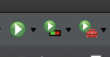

# JaCoCo 설치 및 구성
---

## 소개

> 홈페이지 : https://www.jacoco.org/jacoco/index.html

## Overview

JaCoCo Download
- https://www.jacoco.org/jacoco/index.html
- c:\jacoco  : 적절한 디렉토리에 압축 풀기

STS Plug-in 설치

  
#

#

#
>**finish 후 eclipse restart**

sts 메뉴에 Test Coverage icon 확인


#
show view > coverage 선택


#


###### eclipse > servers > Tomcat 더블클릭 > Open launch configuration >

* Tomcat 서버가 중단된 시점에서 Coverage 실적파일(*.exec) 생성 : default(jacoco.exec)
VM arguments: -javaagent:/Users/skcc03628/jacoco-0.8.7/lib/jacocoagent.jar=destfile=/Users/skcc03628/workspace-spring/jacoco.exec 추가
* Tomcat 서비스 가동 중에 실적 파일 가져오기
VM arguments: -javaagent:/Users/skcc03628/jacoco-0.8.7/lib/jacocoagent.jar=output=tcpserver 추가

> 참고 : https://www.jacoco.org/jacoco/trunk/doc/agent.html


#
- CoverageTest Web Service Start
- Eclemma로 측정 결과 보기(Coverage 탭 그리드에서 우클릭 후  Import Session... 실행, Agent Address 선택, Next, 소스 선택, Finish)

#
<details markdown="1">
<summary>jacoco 참고</summary>

- WAS VM Argument 설정

```bash
###  WAS VM Argumet 설정 스크립트

-javaagent:c:\jacoco\lib\jacocoagent.jar=output=tcpserver

-javaagent:c:\jacoco\lib\jacocoagent.jar=output=tcpserver,address=172.xx.xx.xx


###  CLI Command 참고 ####################고#########################################################

java -jar c:\jacoco\lib\jacococli.jar dump --address 127.0.0.1 --port 6300 --destfile c:\jacoco\dump01.exec

java -jar c:\jacoco\lib\jacococli.jar dump --address 127.0.0.1 --port 6300 --destfile c:\jacoco\dump02.exec


java -jar c:\jacoco\lib\jacococli.jar merge c:\jacoco\dump01.exec c:\jacoco\dump02.exec --destfile c:\jacoco\merge.exec

java -jar c:\jacoco\lib\jacococli.jar merge c:\jacoco\dump0*.exec --destfile c:\jacoco\merge.exec


java -jar c:\jacoco\lib\jacococli.jar report c:\jacoco\merge.exec --encoding UTF-8 --html c:\jacoco\CoverageTestReport --name report --classfiles C:\sts_workspace\CoverageTest\build\classes --sourcefiles C:\sts_workspace\CoverageTest\src

java -jar c:\jacoco\lib\jacococli.jar report c:\jacoco\merge.exec --encoding UTF-8 --xml c:\jacoco\CoverageTestReport.xml --name report --classfiles C:\sts_workspace\CoverageTest\build\classes --sourcefiles C:\sts_workspace\CoverageTest\src


java -jar c:\jacoco\lib\jacococli.jar execinfo c:\jacoco\dump01.exec > c:\jacoco\dump01.txt

java -jar c:\jacoco\lib\jacococli.jar execinfo c:\jacoco\dump02.exec > c:\jacoco\dump02.txt
```

</details>