# Jenkins로 기본 CI Pipeline 구축

## Jenkins와 GitHub 연동

`Freestyle project` Job을 생성하여 GitHub과 연동하는 방법을 알아 봅니다.

### Jenkins Job 구성

|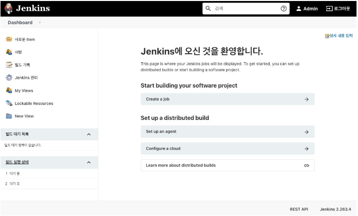
|-

다음과 같이 수행하여 Jenkins Job을 생성하고 구성합니다.

- 사이드 바에서 **새로운 Item (New Item)** 메뉴를 클릭 합니다.
- Job 이름을 입력하고 `Freestyle project`를 선택한 다음 **OK** 버튼을 클릭합니다.
- **소스 코드 관리** 탭을 클릭하면 아래로 스크롤 되어 **소스 코드 관리** 섹션으로 이동합니다.
- `Git`을 선택하면 Repository 정보를 입력할 수 있는 폼이 나타납니다.
- GitHub Repository의 녹색 버튼을 클릭하여 Clone HTTPS URL을 복사하여 Jenkins의 Repository URL 필드에 붙여 넣습니다.
- **Credentials** 필드의 **Add** 버튼을 클릭합니다.
- **Jenkins Credentials Provider: Jenkins** 모달 창이 나타나면, 다음 항목을 입력하거나 선택한 후 **Add** 버튼을 클릭합니다.

  - **Domain** : `Global credentials (unrestricted)` 선택
  - **Kind** : `Username and password` 선택
  - **Scope** : `Global (Jenkins, nodes, items, all child items, etc)` 선택
  - **Username** : GitHub의 ID 또는 이메일 입력
  - **Password** : GitHub 패스워드 입력
  - **ID** : 원하는 고유한 ID 입력
  - **Description** : (선택사항) 유사한 자격 증명(credentials)을 구분하는 데 도움이 되는 설명 입력

    |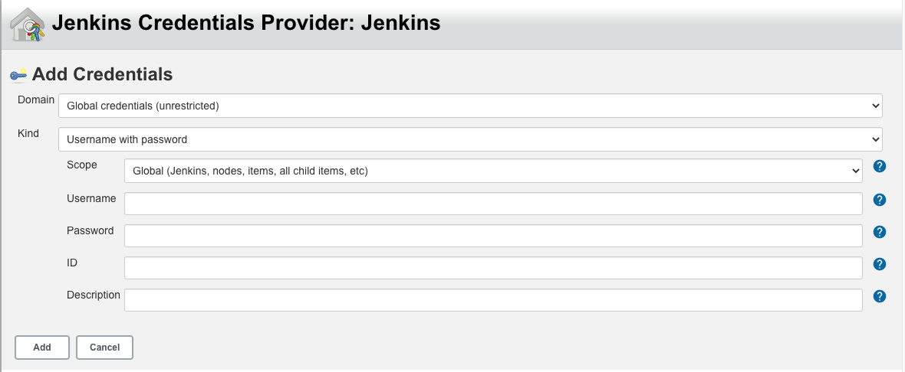
    |-

    > 생성된 자격 증명(credentials)은 **Dashboard dropdown menu > Jenkins 관리 > Security > Manage Credentials**을 선택하면 확인할 수 있습니다.

- **Credentials** 필드에 방금 생성한 자격 증명을 선택합니다.

  |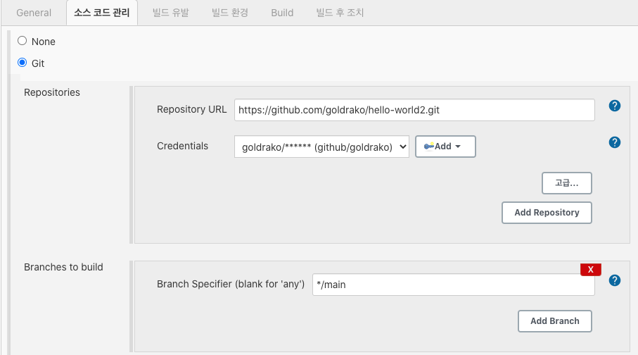
  |-

- **저장** 버튼을 클릭합니다.

### Jenkins Job 실행

- 사이드 바에서 **Build Now**를 클릭하면 Job이 실행됩니다.
- **Build History**에서 **#일련번호**을 선택한 다음, **Console Output**을 선택하면 빌드 로그를 확인할 수 있습니다.

|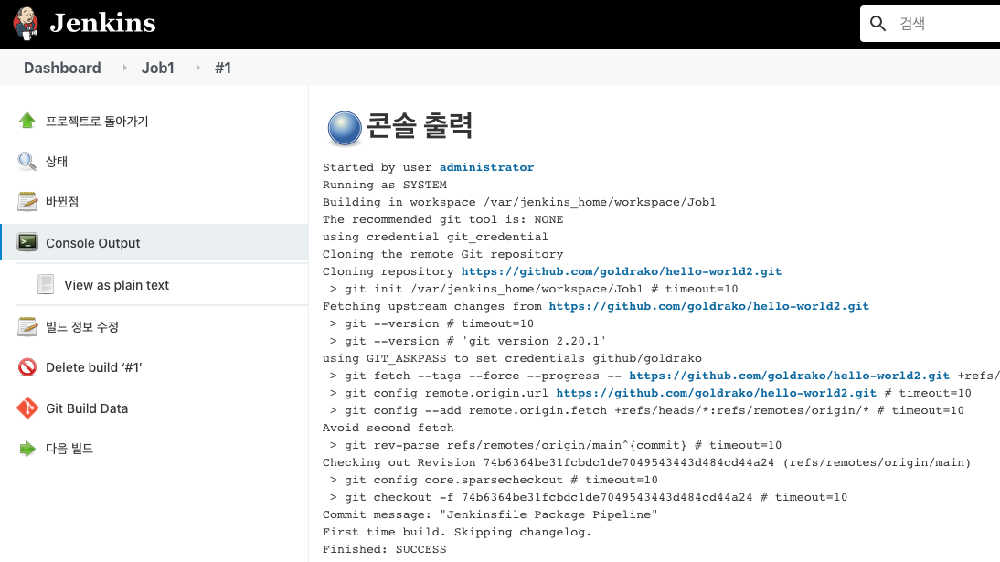
|-

> 콘솔 출력 정보에 workspace path는 docker-compose에서 지정한 실제 path에 저장 된다.

```text
Started by user administrator
Running as SYSTEM
Building in workspace /var/jenkins_home/workspace/Job1
➔ 실제 위치 : /data/jenkins/jenkins_home/workspace/Job1
...
(생략)
```
## webhook 이용한 빌드
git remote service(예: github)에 해당 레포지토리에 `PUSH `가 발생할 때 Jenkins 서버에 이벤트를 발생시키면 젠킨스는 프리스타일 잡에서 빌드유발에 등록된 webhook으로 자동으로 잡이 실행토록 함

 ### github webhook 걸기

|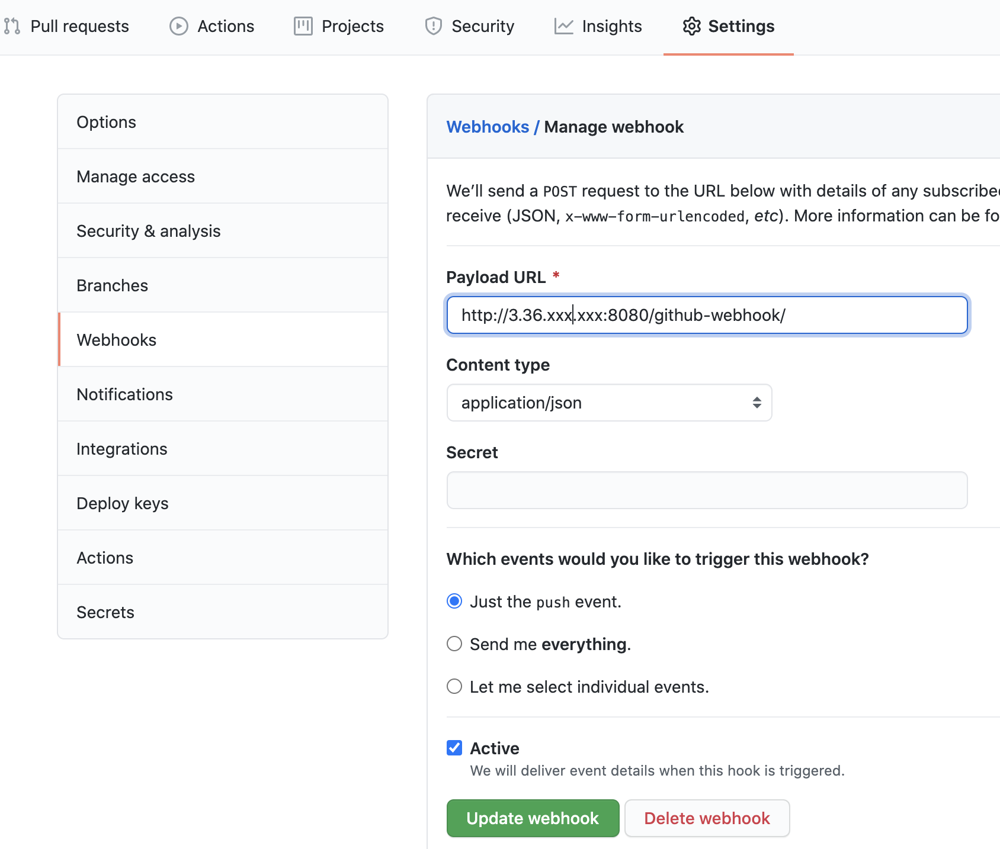
|-

### Jenkins webhook 처리

**1. Github Integeration Plugin 설치** 
 - Github와 Jenkins를 연결하려면 `Github Integeration Plugin`이 필요하다.
 - Jenkins관리 >> 플러그인 관리 
 - 설치 가능 탭 >> Github Integration 검색 >> 설치 

**2. Jenkins 설정** 
 - 신규 Item을 생성하거나, 이전 포스팅에서 생성하였던 Github과 연동 되어있는 Item 설정 페이지로 이동. 
 - 빌드 유발 탭 이동 >> GitHub hook trigger for GITScm polling 체크 


## 기본 CI Pipeline 구성

### Jenkinsfile 생성

Jenkins Pipeline은 Jenkins에 지속적 전달(delivery) 파이프라인을 구현하고 통합하는 것을 지원하는 플러그인 모음입니다.  
Pipeline은 Pipeline DSL(domain-specific language, 도메인 특정 언어) 구문을 통해 "코드로" 간단한 것에서 복잡한 것으로(simple-to-complex) 전달 파이프라인을 모델링하기 위한 확장 가능한 도구 세트를 제공합니다.

Jenkins Pipeline의 정의는 프로젝트의 소스 제어 저장소에 커밋 될 수 있는 텍스트 파일(Jenkinsfile)에 기록됩니다.

다음을 수행하여 `Jenkinsfile` 파일을 작성하고 GitHub에 Push 합니다.

- `hello-world` Workspace에서 `Jenkinsfile` 파일을 생성하고 아래 내용을 붙여 넣습니다.

  ```groovy
  pipeline {
      agent any
      stages {
          stage('Build') {
              steps {
                  sh './mvnw clean compile'
              }
          }
      }
  }
  ```

- 아래 명령을 수행하여 GitHub에 Push 합니다.

  ```bash
  git add .
  git commit -m "Add initial Jenkinsfile"
  git push
  ```

### CI Pipeline Job 생성

- 사이드 바에서 **새로운 Item (New Item)** 메뉴를 클릭 합니다.
- Job 이름을 입력하고 `Pipeline`를 선택한 다음 **OK** 버튼을 클릭합니다.
- **Pipeline** 탭을 클릭하면 아래로 스크롤 되어 **Pipeline** 섹션으로 이동합니다.
- **Definition** 필드에 `Pipeline script from SCM`을 선택합니다.
- **SCM** 필드에 `Git`을 선택합니다.
- **Repository URL** 필드에 GitHub Repository의 Clone HTTPS URL을 복사하여 붙여 넣습니다.
- **Credentials** 필드에 이전 단계에서 생성한 자격 증명을 선택합니다.
- **Branch Specifier** 필드에 `*/main`으로 수정한 다음 **저장** 버튼을 클릭합니다.

  > 최근 github 대표 브랜치 이름을 **master**에서  **main**으로 바뀌었습니다.

| 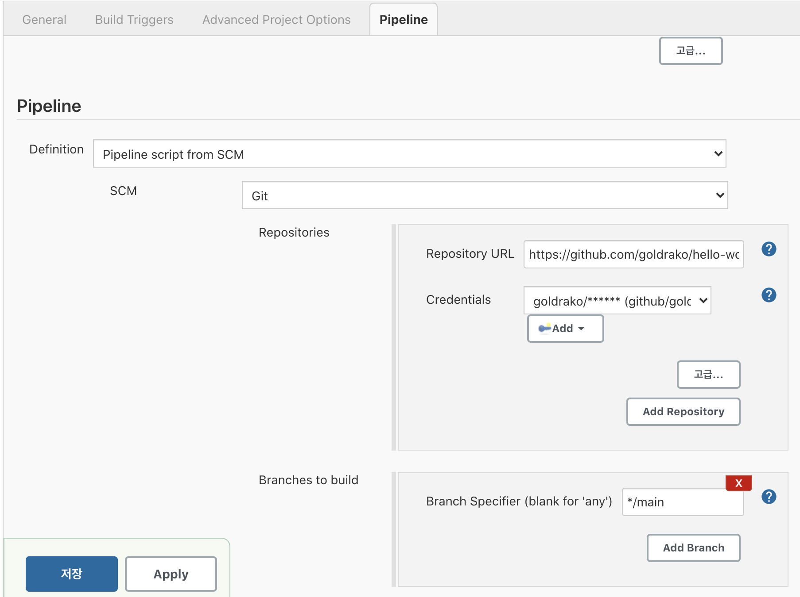 |
| ------------------------------------------------------------------------------------------------------------ |
### CI Pipeline Job 실행

- 사이드 바에서 **Build Now**를 클릭하면 Job이 실행됩니다.
- **Build History**에서 **#일련번호**을 선택한 다음, **Console Output**을 선택하면 빌드 로그를 확인할 수 있습니다.

<details markdown="1">
<summary>Console Output 내용</summary>

```bash
Started by user Admin
Obtained Jenkinsfile from git https://github.com/goldrako/hello-world2.git
Running in Durability level: MAX_SURVIVABILITY
[Pipeline] Start of Pipeline
[Pipeline] node
Running on Jenkins in /var/jenkins_home/workspace/Hello-World-Basic-CI-Pipeline
[Pipeline] {
[Pipeline] stage
[Pipeline] { (Declarative: Checkout SCM)
[Pipeline] checkout
Selected Git installation does not exist. Using Default
The recommended git tool is: NONE
using credential jason_github
Cloning the remote Git repository
Cloning repository https://github.com/goldrako/hello-world2.git
 > git init /var/jenkins_home/workspace/Hello-World-Basic-CI-Pipeline # timeout=10
Fetching upstream changes from https://github.com/goldrako/hello-world2.git
 > git --version # timeout=10
 > git --version # 'git version 2.20.1'
using GIT_ASKPASS to set credentials
 > git fetch --tags --force --progress -- https://github.com/goldrako/hello-world2.git +refs/heads/*:refs/remotes/origin/* # timeout=10
 > git config remote.origin.url https://github.com/goldrako/hello-world2.git # timeout=10
 > git config --add remote.origin.fetch +refs/heads/*:refs/remotes/origin/* # timeout=10
Avoid second fetch
 > git rev-parse refs/remotes/origin/main^{commit} # timeout=10
Checking out Revision 95a5f79caf70c3466a9975a65af4a02d155ec948 (refs/remotes/origin/main)
 > git config core.sparsecheckout # timeout=10
 > git checkout -f 95a5f79caf70c3466a9975a65af4a02d155ec948 # timeout=10
Commit message: "Add initial Jenkinsfile"
First time build. Skipping changelog.
[Pipeline] }
[Pipeline] // stage
[Pipeline] withEnv
[Pipeline] stage
[Pipeline] { (Build)
[Pipeline] sh
+ ./mvnw clean compile
[INFO] Scanning for projects...
[INFO]
[INFO] ----------------------< com.skcc:hello-world >-----------------------
[INFO] Building hello-world 0.0.1-SNAPSHOT
[INFO] --------------------------------[ jar ]---------------------------------
[INFO]
[INFO] --- maven-clean-plugin:3.1.0:clean (default-clean) @ hello-world ---
[INFO] Deleting /var/jenkins_home/workspace/Hello-World-Basic-CI-Pipeline/target
[INFO]

(생략)

Downloaded from central: https://repo.maven.apache.org/maven2/org/codehaus/plexus/plexus-compiler-api/2.8.4/plexus-compiler-api-2.8.4.jar (27 kB at 27 kB/s)
Downloaded from central: https://repo.maven.apache.org/maven2/org/codehaus/plexus/plexus-compiler-manager/2.8.4/plexus-compiler-manager-2.8.4.jar (4.7 kB at 4.5 kB/s)
Downloaded from central: https://repo.maven.apache.org/maven2/org/codehaus/plexus/plexus-compiler-javac/2.8.4/plexus-compiler-javac-2.8.4.jar (21 kB at 20 kB/s)
[INFO] Changes detected - recompiling the module!
[INFO] Compiling 1 source file to /var/jenkins_home/workspace/Hello-World-Basic-CI-Pipeline/target/classes
[INFO] ------------------------------------------------------------------------
[INFO] BUILD SUCCESS
[INFO] ------------------------------------------------------------------------
[INFO] Total time:  01:26 min
[INFO] Finished at: 2021-03-01T10:34:52Z
[INFO] ------------------------------------------------------------------------
[Pipeline] }
[Pipeline] // stage
[Pipeline] }
[Pipeline] // withEnv
[Pipeline] }
[Pipeline] // node
[Pipeline] End of Pipeline
Finished: SUCCESS
```
</details><br>

> Linux 게열에서 './mvnw: Permission denied' 오류가 발생하면 `hello-world` Workspace로 이동하여 `sudo chmod +x mvnw` 명령을 수행하고 Git Push 합니다.

## CI Pipeline에 Unit Test 추가

### Unit Test 코드 작성

|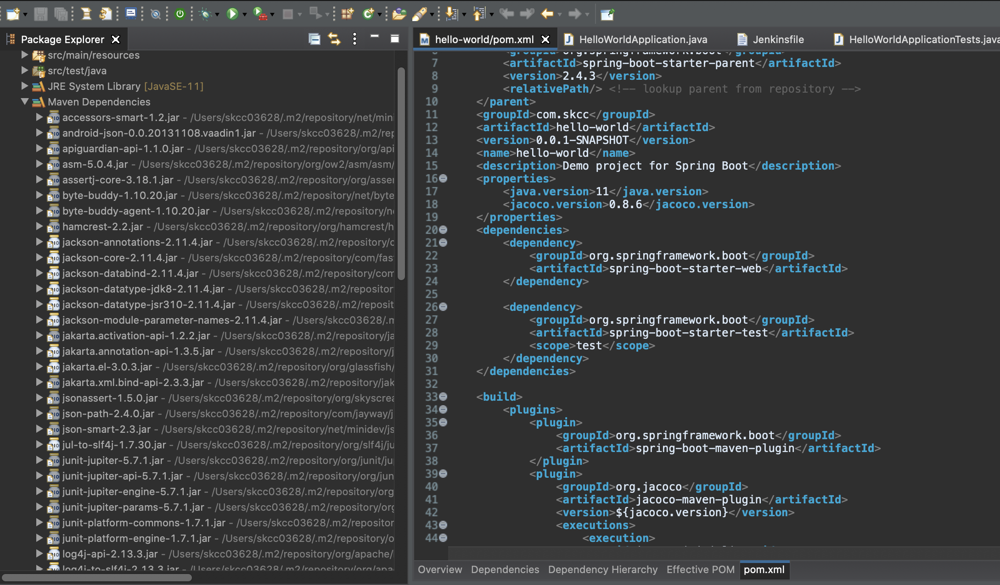
|-

> pom.xml에 [Spring Boot Starter Test](https://mvnrepository.com/artifact/org.springframework.boot/spring-boot-starter-test) dependency를 추가하면 Java 기반 애플리케이션 Unit Test에 필요한 [JUnit](https://junit.org/junit5/docs/current/user-guide/), [Hamcrest](http://hamcrest.org/JavaHamcrest/tutorial) 및 [Mockito](https://site.mockito.org/) 의존성 라이브러리가 설치됩니다.

다음을 수행하여 단위 테스트 코드를 작성하고 GitHub에 Push 합니다.

- STS에서 `src/test/java` 디렉토리 하위에 프로젝트 생성 시 지정했던 패키지의 `HelloWorldApplicationTests` 파일을 열고, 아래와 같이 수정합니다.

  ```java
  package com.skcc.hello;

  import static org.hamcrest.CoreMatchers.equalTo;
  import static org.springframework.test.web.servlet.result.MockMvcResultMatchers.content;
  import static org.springframework.test.web.servlet.result.MockMvcResultMatchers.status;

  import org.junit.jupiter.api.Test;
  import org.springframework.beans.factory.annotation.Autowired;
  import org.springframework.boot.test.autoconfigure.web.servlet.AutoConfigureMockMvc;
  import org.springframework.boot.test.context.SpringBootTest;
  import org.springframework.http.MediaType;
  import org.springframework.test.web.servlet.MockMvc;
  import org.springframework.test.web.servlet.request.MockMvcRequestBuilders;

  @SpringBootTest
  @AutoConfigureMockMvc
  class HelloWorldApplicationTests {

      @Autowired
      private MockMvc mvc;

      @Test
      public void getHello() throws Exception {
          mvc.perform(MockMvcRequestBuilders.get("/hello").accept(MediaType.APPLICATION_JSON))
                  .andExpect(status().isOk())
                  .andExpect(content().string(equalTo("Hello World!")));
      }
  }
  ```

- 아래 명령을 수행하여 GitHub에 Push 합니다.

  ```bash
  git add .
  git commit -m "Add Unit test"
  git push
  ```

### Jenkinsfile에 `Unit Test` stage 추가

다음을 수행하여 `Jenkinsfile` 파일에 `Unit Test` stage를 추가하고 GitHub에 Push 합니다.

- `Jenkinsfile` 파일을 열고 `Build` stage 다음에 아래 내용을 붙여 넣습니다.

  ```groovy
  stage('Unit Test') {
      steps {
          sh './mvnw test'
      }
      post {
          always {
              junit 'target/surefire-reports/*.xml'
          }
      }
  }
  ```

- 아래 명령을 수행하여 GitHub에 Push 합니다.

  ```bash
  git add .
  git commit -m "Add 'Unit Test' stage to Jenkinsfile"
  git push
  ```

### CI Pipeline Job 실행 (Build > Unit Test)

- 사이드 바에서 **Build Now**를 클릭하여 Job이 실행합니다.
- **Build History**에서 **#일련번호**을 선택한 다음, **Console Output**을 선택하면 빌드 로그를 확인합니다.

<details markdown="1">
<summary>Console Output 내용</summary>

```bash
Started by user Admin
Obtained Jenkinsfile from git https://github.com/goldrako/hello-world2.git
Running in Durability level: MAX_SURVIVABILITY
[Pipeline] Start of Pipeline
[Pipeline] node
Running on Jenkins in /var/jenkins_home/workspace/Hello-World-Basic-CI-Pipeline
[Pipeline] {
[Pipeline] stage
[Pipeline] { (Declarative: Checkout SCM)
[Pipeline] checkout
Selected Git installation does not exist. Using Default
The recommended git tool is: NONE
using credential jason_github
 > git rev-parse --is-inside-work-tree # timeout=10
Fetching changes from the remote Git repository
 > git config remote.origin.url https://github.com/goldrako/hello-world2.git # timeout=10
Fetching upstream changes from https://github.com/goldrako/hello-world2.git
 > git --version # timeout=10
 > git --version # 'git version 2.20.1'
using GIT_ASKPASS to set credentials
 > git fetch --tags --force --progress -- https://github.com/goldrako/hello-world2.git +refs/heads/*:refs/remotes/origin/* # timeout=10
 > git rev-parse refs/remotes/origin/main^{commit} # timeout=10
Checking out Revision 5ffe5f39d630a6f5cf06f4b56487942721e6f965 (refs/remotes/origin/main)
 > git config core.sparsecheckout # timeout=10
 > git checkout -f 5ffe5f39d630a6f5cf06f4b56487942721e6f965 # timeout=10
Commit message: "Add 'Unit Test' stage to Jenkinsfile"
 > git rev-list --no-walk 95a5f79caf70c3466a9975a65af4a02d155ec948 # timeout=10
[Pipeline] }
[Pipeline] // stage
[Pipeline] withEnv
[Pipeline] {
[Pipeline] isUnix
[Pipeline] sh
+ ./mvnw clean compile
[INFO] Scanning for projects...

(생략)

[INFO] --- maven-compiler-plugin:3.8.1:compile (default-compile) @ hello-world ---
[INFO] Changes detected - recompiling the module!
[INFO] Compiling 1 source file to /var/jenkins_home/workspace/Hello-World-Basic-CI-Pipeline/target/classes
[INFO] ------------------------------------------------------------------------
[INFO] BUILD SUCCESS
[INFO] ------------------------------------------------------------------------
[INFO] Total time:  3.229 s
[INFO] Finished at: 2021-03-02T04:59:55Z
[INFO] ------------------------------------------------------------------------
[Pipeline] }
[Pipeline] // stage
[Pipeline] stage
[Pipeline] { (Unit Test)
[Pipeline] sh
+ mvn test
[INFO] Scanning for projects...
[INFO]
[INFO] ----------------------< com.skcc:hello-world >-----------------------
[INFO] Building hello-world 0.0.1-SNAPSHOT
[INFO] --------------------------------[ jar ]---------------------------------
Downloading from central: https://repo.maven.apache.org/maven2/org/apache/maven/plugins/maven-surefire-plugin/2.22.2/maven-surefire-plugin-2.22.2.pom
Progress (1): 2.7/5.0 kB
Progress (1): 5.0 kB

(생략)

2021-03-02 05:00:20.302  INFO 142 --- [           main] i.i.hello.HelloWorldApplicationTests     : Started HelloWorldApplicationTests in 2.489 seconds (JVM running for 3.925)
[INFO] Tests run: 1, Failures: 0, Errors: 0, Skipped: 0, Time elapsed: 3.618 s - in com.skcc.hello.HelloWorldApplicationTests
2021-03-02 05:00:20.856  INFO 142 --- [extShutdownHook] o.s.s.concurrent.ThreadPoolTaskExecutor  : Shutting down ExecutorService 'applicationTaskExecutor'
[INFO]
[INFO] Results:
[INFO]
[INFO] Tests run: 1, Failures: 0, Errors: 0, Skipped: 0
[INFO]
[INFO] ------------------------------------------------------------------------
[INFO] BUILD SUCCESS
[INFO] ------------------------------------------------------------------------
[INFO] Total time:  23.190 s
[INFO] Finished at: 2021-03-02T05:00:21Z
[INFO] ------------------------------------------------------------------------
[Pipeline] }
[Pipeline] // stage
[Pipeline] }
[Pipeline] // withEnv
[Pipeline] }
[Pipeline] // node
[Pipeline] End of Pipeline
Finished: SUCCESS
```

</details><br>

### Unit Test Report

|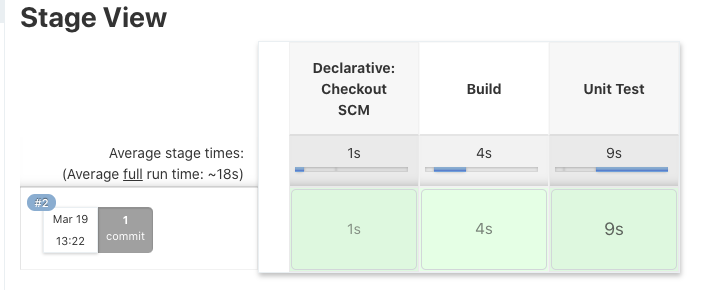
|-

사이드 바에서 **Test Result**를 클릭하면 Unit Test Report를 확인할 수 있습니다.

|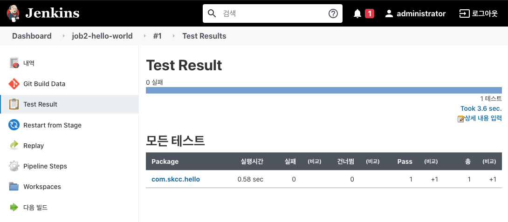
|-

## Unit Test stage 개선

[JaCoCo](https://www.eclemma.org/jacoco/) 라이브러리를 사용하여 CI Pipeline의 Unit Test stage에 Code Coverage를 추가합니다.  
Jenkins에서 Job을 실행하고 Code Coverage report로 확인합니다.

### JaCoCo Maven plugin 추가

다음을 수행하여 `pom.xml`에 **JaCoCo Maven plugin**을 추가하고 GitHub에 Push 합니다.

- STS에서 `pom.xml` 파일을 열고 `properties` 엘리먼트(element)에서 `java.version` 아래에 다음 내용을 추가합니다.

  ```xml
  <jacoco.version>0.8.6</jacoco.version>
  ```

- `build > plugins` 엘리먼트에 다음 내용을 추가합니다.

  ```xml
  <plugin>
      <groupId>org.jacoco</groupId>
      <artifactId>jacoco-maven-plugin</artifactId>
      <version>${jacoco.version}</version>
      <executions>
          <execution>
              <id>jacoco-initialize</id>
              <goals>
                  <goal>prepare-agent</goal>
              </goals>
          </execution>
          <execution>
              <id>jacoco-site</id>
              <phase>test</phase>
              <goals>
                  <goal>report</goal>
              </goals>
          </execution>
      </executions>
  </plugin>
  ```

- 터미널에서 아래 명령을 수행하여 GitHub에 Push 합니다.

  ```bash
  git add .
  git commit -m "Add 'JaCoCo Maven plugin' in pom.xml"
  git push
  ```

### Jenkins에 JaCoCo plugin 설치

Jenkins UI를 통해 JaCoCo Code Coverage 결과를 보기 위해 [JaCoCo plugin](https://plugins.jenkins.io/jacoco/)을 설치합니다.

- **Dashboard dropdown menu > Jenkins 관리 > System Configuration > 플러그인 관리**을 선택합니다.
- **설치 가능** 탭을 클릭하고 검색 필드에 `jacoco`를 입력합니다.
- **JaCoCo** 플러그인을 체크하고 설치합니다.

### Jenkinsfile에 `Unit Test` stage 수정

다음을 수행하여 `Jenkinsfile` 파일에 `Unit Test` stage를 수정하고 GitHub에 Push 합니다.

- `Jenkinsfile` 파일을 열고 `Unit Test` stage를 `step([ $class: 'JacocoPublisher' ])`를 추가하여 아래와 같이 수정합니다.

  ```groovy
  stage('Unit Test') {
      steps {
          sh './mvnw test'
      }
      post {
          always {
              junit 'target/surefire-reports/*.xml'
              step([ $class: 'JacocoPublisher' ])
          }
      }
  }
  ```

- 아래 명령을 수행하여 GitHub에 Push 합니다.

  ```bash
  git add .
  git commit -m "Update 'Unit Test' stage in Jenkinsfile"
  git push
  ```

### Jenkins CI Pipeline Job 실행 (Unit Test & Code Coverage)

- **Dashboard**에서 Job 선택한 다음, 사이드 바에서 **Build Now**를 클릭하여 Job이 실행합니다.
- **Build History**에서 **#일련번호**을 선택한 다음, **Console Output**을 선택하여 빌드 로그를 확인합니다.

<details markdown="1">
<summary>Console Output 내용</summary>

```bash
Started by user Admin
Obtained Jenkinsfile from git https://github.com/goldrako/hello-world2.git
Running in Durability level: MAX_SURVIVABILITY
[Pipeline] Start of Pipeline
[Pipeline] node
Running on Jenkins in /var/jenkins_home/workspace/Hello-World-Basic-CI-Pipeline
[Pipeline] {
[Pipeline] stage
[Pipeline] { (Declarative: Checkout SCM)
[Pipeline] checkout
Selected Git installation does not exist. Using Default
The recommended git tool is: NONE
using credential jason_github
 > git rev-parse --is-inside-work-tree # timeout=10
Fetching changes from the remote Git repository
 > git config remote.origin.url https://github.com/goldrako/hello-world2.git # timeout=10
Fetching upstream changes from https://github.com/goldrako/hello-world2.git
 > git --version # timeout=10
 > git --version # 'git version 2.20.1'
using GIT_ASKPASS to set credentials
 > git fetch --tags --force --progress -- https://github.com/goldrako/hello-world2.git +refs/heads/*:refs/remotes/origin/* # timeout=10
 > git rev-parse refs/remotes/origin/main^{commit} # timeout=10
Checking out Revision 26f144cf5e1d303d6cd53eed2395ca860a64baf7 (refs/remotes/origin/main)
 > git config core.sparsecheckout # timeout=10
 > git checkout -f 26f144cf5e1d303d6cd53eed2395ca860a64baf7 # timeout=10
Commit message: "Update 'Unit Test' stage in Jenkinsfile"
 > git rev-list --no-walk 26f144cf5e1d303d6cd53eed2395ca860a64baf7 # timeout=10
[Pipeline] }
[Pipeline] // stage
[Pipeline] withEnv
[Pipeline] {
[Pipeline] stage
[Pipeline] { (Build)
[Pipeline] sh
+ ./mvnw clean compile
[INFO] Scanning for projects...

(생략)

[INFO] --- maven-compiler-plugin:3.8.1:compile (default-compile) @ hello-world ---
[INFO] Changes detected - recompiling the module!
[INFO] Compiling 1 source file to /var/jenkins_home/workspace/Hello-World-Basic-CI-Pipeline/target/classes
[INFO] ------------------------------------------------------------------------
[INFO] BUILD SUCCESS
[INFO] ------------------------------------------------------------------------
[INFO] Total time:  2.703 s
[INFO] Finished at: 2021-03-03T15:36:58Z
[INFO] ------------------------------------------------------------------------
[Pipeline] }
[Pipeline] // stage
[Pipeline] stage
[Pipeline] { (Unit Test)
[Pipeline] sh
+ ./mvnw test
[INFO] Scanning for projects...
[INFO]
[INFO] ----------------------< com.skcc:hello-world >-----------------------
[INFO] Building hello-world 0.0.1-SNAPSHOT
[INFO] --------------------------------[ jar ]---------------------------------
[INFO]
[INFO] --- jacoco-maven-plugin:0.8.6:prepare-agent (jacoco-initialize) @ hello-world ---
[INFO] argLine set to -javaagent:/var/jenkins_home/.m2/repository/org/jacoco/org.jacoco.agent/0.8.6/org.jacoco.agent-0.8.6-runtime.jar=destfile=/var/jenkins_home/workspace/Hello-World-Basic-CI-Pipeline3/target/jacoco.exec

(생략)

[INFO] Tests run: 1, Failures: 0, Errors: 0, Skipped: 0, Time elapsed: 5.658 s - in com.skcc.hello.HelloWorldApplicationTests
2021-03-03 15:37:12.220  INFO 113 --- [extShutdownHook] o.s.s.concurrent.ThreadPoolTaskExecutor  : Shutting down ExecutorService 'applicationTaskExecutor'
[INFO]
[INFO] Results:
[INFO]
[INFO] Tests run: 1, Failures: 0, Errors: 0, Skipped: 0
[INFO]
[INFO]
[INFO] --- jacoco-maven-plugin:0.8.6:report (jacoco-site) @ hello-world ---
[INFO] Loading execution data file /var/jenkins_home/workspace/Hello-World-Basic-CI-Pipeline/target/jacoco.exec
[INFO] Analyzed bundle 'hello-world' with 1 classes
[INFO]
[INFO] ----------------------< com.skcc:hello-world >-----------------------
[INFO] Building hello-world 0.0.1-SNAPSHOT
[INFO] --------------------------------[ jar ]---------------------------------
[INFO]
[INFO] --- sonar-maven-plugin:3.8.0.2131:sonar (default-cli) @ hello-world ---
[INFO] User cache: ?/.sonar/cache
[INFO] SonarQube version: 7.9.5
[INFO] Default locale: "en_US", source code encoding: "UTF-8"
[INFO] Load global settings
[INFO] Load global settings (done) | time=158ms
[INFO] Server id: 243B8A4D-AXf4qbpWGV-bgRqG7lDY
[INFO] User cache: /var/jenkins_home/workspace/Hello-World-Basic-CI-Pipeline/?/.sonar/cache
[INFO] Load/download plugins
[INFO] Load plugins index
[INFO] Load plugins index (done) | time=121ms
[INFO] Load/download plugins (done) | time=2480ms

(생략)

[INFO] ------------- Run sensors on project
[INFO] Sensor Zero Coverage Sensor
[INFO] Sensor Zero Coverage Sensor (done) | time=0ms
[INFO] Sensor Java CPD Block Indexer
[INFO] Sensor Java CPD Block Indexer (done) | time=22ms
[INFO] SCM provider for this project is: git
[INFO] 3 files to be analyzed
[INFO] 3/3 files analyzed
[INFO] 1 file had no CPD blocks
[INFO] Calculating CPD for 0 files
[INFO] CPD calculation finished
[INFO] Analysis report generated in 90ms, dir size=84 KB
[INFO] Analysis report compressed in 6ms, zip size=15 KB
[INFO] Analysis report uploaded in 264ms
[INFO] ANALYSIS SUCCESSFUL, you can browse http://xx.xx.xxx.xx:9000/dashboard?id=com.skcc%3Ahello-world
[INFO] Note that you will be able to access the updated dashboard once the server has processed the submitted analysis report
[INFO] More about the report processing at http://xx.xx.xxx.xx:9000/api/ce/task?id=AXf4vJPVGV-bgRqG7nL0
[INFO] Analysis total time: 7.661 s
[INFO] ------------------------------------------------------------------------
[INFO] BUILD SUCCESS
[INFO] ------------------------------------------------------------------------
[INFO] Total time:  23.366 s
[INFO] Finished at: 2021-03-03T15:37:24Z
[INFO] ------------------------------------------------------------------------
Post stage
[Pipeline] junit
Recording test results
[Checks API] No suitable checks publisher found.
[Pipeline] jacoco
[JaCoCo plugin] Collecting JaCoCo coverage data...
[JaCoCo plugin] **/**.exec;**/classes;**/src/main/java; locations are configured
[JaCoCo plugin] Number of found exec files for pattern **/**.exec: 1
[JaCoCo plugin] Saving matched execfiles:  /var/jenkins_home/workspace/Hello-World-Basic-CI-Pipeline/target/jacoco.exec
[JaCoCo plugin] Saving matched class directories for class-pattern: **/classes:
[JaCoCo plugin]  - /var/jenkins_home/workspace/Hello-World-Basic-CI-Pipeline/target/classes 1 files
[JaCoCo plugin] Saving matched source directories for source-pattern: **/src/main/java:
[JaCoCo plugin] Source Inclusions: **/*.java,**/*.groovy,**/*.kt,**/*.kts
[JaCoCo plugin] Source Exclusions:
[JaCoCo plugin] - /var/jenkins_home/workspace/Hello-World-Basic-CI-Pipeline/src/main/java 1 files
[JaCoCo plugin] Loading inclusions files..
[JaCoCo plugin] inclusions: []
[JaCoCo plugin] exclusions: []
[JaCoCo plugin] Thresholds: JacocoHealthReportThresholds [minClass=0, maxClass=0, minMethod=0, maxMethod=0, minLine=0, maxLine=0, minBranch=0, maxBranch=0, minInstruction=0, maxInstruction=0, minComplexity=0, maxComplexity=0]
[JaCoCo plugin] Publishing the results..
[JaCoCo plugin] Loading packages..
[JaCoCo plugin] Done.
[JaCoCo plugin] Overall coverage: class: 100.0, method: 66.66667, line: 50.0, branch: 100.0, instruction: 70.588234, complexity: 66.66667
[Pipeline] }
[Pipeline] // stage
[Pipeline] }
[Pipeline] // withEnv
[Pipeline] }
[Pipeline] // withEnv
[Pipeline] }
[Pipeline] // node
[Pipeline] End of Pipeline
Finished: SUCCESS
```

</details><br>


### Jenkins에서 Code Coverage 결과 확인

Job Dashboard 화면에 **Code Coverage Trend**가 추가된 것을 확인합니다.

|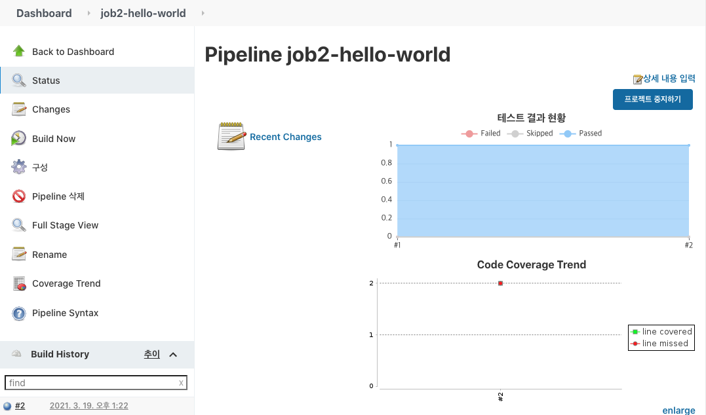
|-

Job Build 번호를 클릭하여 상세 페이지로 이동하면 **Jacoco - Overall Coverage Summary**이 추가된 것을 알 수 있습니다.

|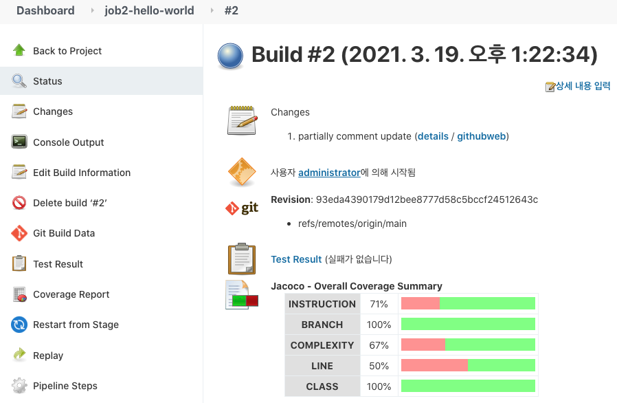
|-

사이드 바에서 **Coverage Report**를 클릭하면 **JaCoCo Coverage Report**를 확인할 수 있습니다.

|
|-

## Static Code Analysis

Jenkins와 SonarQube 연동 설장하고 Jenkins에서 Job을 실행하여 SonarQube에서 Code Coverage report 및 정적 코드 분석 결과를 확인합니다.

### SonarQube Token 생성

SonarQube에서 아래와 같이 수행하여 인증 Token을 생성합니다.

- 우측 상단의 프로필 **A**를 클릭한 후 **My Account**를 선택합니다.
- **Security** 탭을 클릭한 다음, **Tokens** 섹션의 **Generate Tokens** 필드에 Token 이름을 입력하고 **Generate** 버튼을 클릭합니다.
- 생성된 Token이 화면에 나타나면 복사하여 기록해 둡니다.

  |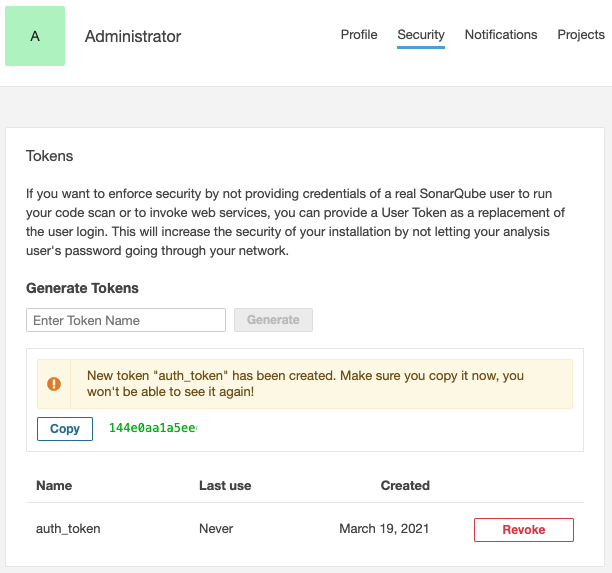
  |-

### Jenkins에 Config File Provider plugin 설치

Jenkins UI를 통해 구성된 Maven settings.xml을 Jenkins Pipeline에서 사용하기 위해 [Jenkins Config File Provider plugin](https://plugins.jenkins.io/config-file-provider/)을 설치합니다.

- **Dashboard dropdown menu > Jenkins 관리 > System Configuration > 플러그인 관리**을 선택합니다.
- **설치 가능** 탭을 클릭하고 검색 필드에 `config`를 입력합니다.
- **Config File Provider** 플러그인을 체크하고 설치합니다.

### Maven settings.xml 설정

- **Dashboard dropdown menu > Jenkins 관리 > System Configuration > Managed files**을 선택합니다.

  |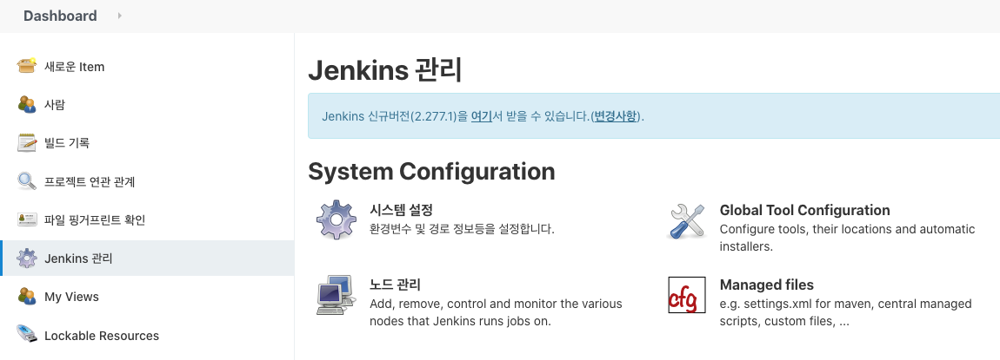
  |-

- 사이드 바에서 **Add a new Config**를 클릭합니다.
- `Global Maven settings.xml`를 체크한 다음 **ID** 필드에 `maven-settings`을 입력하고 **Submit** 버튼을 클릭합니다.

  |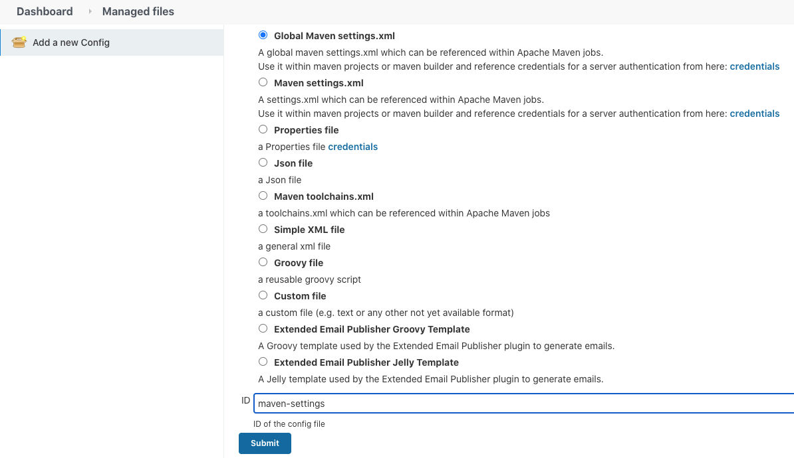
  |-

- **Edit Configuration File** 페이지의 **Content** 필드에 아래 내용을 입력하고 **Submit** 버튼을 클릭합니다.

  ```xml
  <?xml version="1.0" encoding="UTF-8"?>
  <settings xmlns="http://maven.apache.org/SETTINGS/1.0.0"
          xmlns:xsi="http://www.w3.org/2001/XMLSchema-instance"
          xsi:schemaLocation="http://maven.apache.org/SETTINGS/1.0.0 http://maven.apache.org/xsd/settings-1.0.0.xsd">
      <pluginGroups>
          <pluginGroup>org.sonarsource.scanner.maven</pluginGroup>
      </pluginGroups>
      <profiles>
          <profile>
              <id>sonar</id>
              <activation>
                  <activeByDefault>true</activeByDefault>
              </activation>
              <properties>
                  <sonar.host.url>http://[your_sonarqube_ip]:9000</sonar.host.url>
                  <sonar.login>[your_auth_token]</sonar.login>
              </properties>
          </profile>
      </profiles>
  </settings>
  ```

  > **your_sonarqube_ip**와 **your_auth_token**을 수정 반영 저장

  |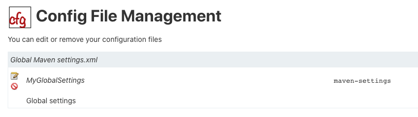
  |-

### Jenkinsfile에 `Static Code Analysis` stage 추가

다음을 수행하여 `Jenkinsfile` 파일에 `Static Code Analysis` stage를 추가하고 GitHub에 Push 합니다.

- `Jenkinsfile` 파일을 열고 `Unit Test` stage 다음에 아래 내용을 붙여 넣습니다.

  ```groovy
  stage('Static Code Analysis') {
      steps {
          configFileProvider([configFile(fileId: 'maven-settings', variable: 'MAVEN_SETTINGS')]) {
              sh './mvnw sonar:sonar -s $MAVEN_SETTINGS'
          }
      }
  }
  ```

- 아래 명령을 수행하여 GitHub에 Push 합니다.

  ```bash
  git add .
  git commit -m "Add 'Static Code Analysis' stage to Jenkinsfile"
  git push
  ```

### Jenkins CI Pipeline Job 실행 (Static Code Analysis)

- **Dashboard**에서 Job 선택한 다음, 사이드 바에서 **Build Now**를 클릭하여 Job이 실행합니다.
- **Build History**에서 **#일련번호**을 선택한 다음, **Console Output**을 선택하여 빌드 로그를 확인합니다.

<details markdown="1">
<summary>Console Output 내용</summary>

```bash
(생략)

[Pipeline] sh
+ ./mvnw sonar:sonar -s /var/jenkins_home/workspace/job2-hello-world@tmp/config12578726871141226244tmp
[INFO] Scanning for projects...
[INFO]
[INFO] ----------------------< com.skcc:hello-world >-----------------------
[INFO] Building hello-world 0.0.1-SNAPSHOT
[INFO] --------------------------------[ jar ]---------------------------------
[INFO]
[INFO] --- sonar-maven-plugin:3.8.0.2131:sonar (default-cli) @ hello-world ---
[INFO] User cache: /var/jenkins_home/.sonar/cache
[INFO] SonarQube version: 7.9.5
[INFO] Default locale: "en_US", source code encoding: "UTF-8"
[INFO] Load global settings
[INFO] Load global settings (done) | time=108ms
[INFO] Server id: 243B8A4D-AXhEhR8Vpt_GcCRKOe5r
[INFO] User cache: /var/jenkins_home/.sonar/cache
[INFO] Load/download plugins

(생략)

[INFO] Sensor Zero Coverage Sensor
[INFO] Sensor Zero Coverage Sensor (done) | time=1ms
[INFO] Sensor Java CPD Block Indexer
[INFO] Sensor Java CPD Block Indexer (done) | time=12ms
[INFO] SCM provider for this project is: git
[INFO] 3 files to be analyzed
[INFO] 3/3 files analyzed
[INFO] 1 file had no CPD blocks
[INFO] Calculating CPD for 0 files
[INFO] CPD calculation finished
[INFO] Analysis report generated in 66ms, dir size=84 KB
[INFO] Analysis report compressed in 11ms, zip size=15 KB
[INFO] Analysis report uploaded in 608ms
[INFO] ANALYSIS SUCCESSFUL, you can browse http://192.168.56.105:9000/dashboard?id=com.skcc%3Ahello-world
[INFO] Note that you will be able to access the updated dashboard once the server has processed the submitted analysis report
[INFO] More about the report processing at http://192.168.56.105:9000/api/ce/task?id=AXhJHJ3EAFWtKEXMAI9I
[INFO] Analysis total time: 5.813 s
[INFO] ------------------------------------------------------------------------
[INFO] BUILD SUCCESS
[INFO] ------------------------------------------------------------------------
[INFO] Total time:  35.302 s
[INFO] Finished at: 2021-03-19T15:11:55+09:00
[INFO] ------------------------------------------------------------------------
[Pipeline] }
Deleting 1 temporary files
[Pipeline] // configFileProvider
[Pipeline] }
[Pipeline] // stage
[Pipeline] }
[Pipeline] // withEnv
[Pipeline] }
[Pipeline] // withEnv
[Pipeline] }
[Pipeline] // node
[Pipeline] End of Pipeline
Finished: SUCCESS
```

</details><br>


### SonarQube에서 결과 확인

다음을 수행하여 Code Coverage 및 정적 코드 분석 결과를 확인합니다.

- **SonarQube**에 접속한 다음, 상단 네비게이션 바에서 **Projects**를 클릭하면 아래와 같이 프로젝트 목록을 확인할 수 있습니다.

  |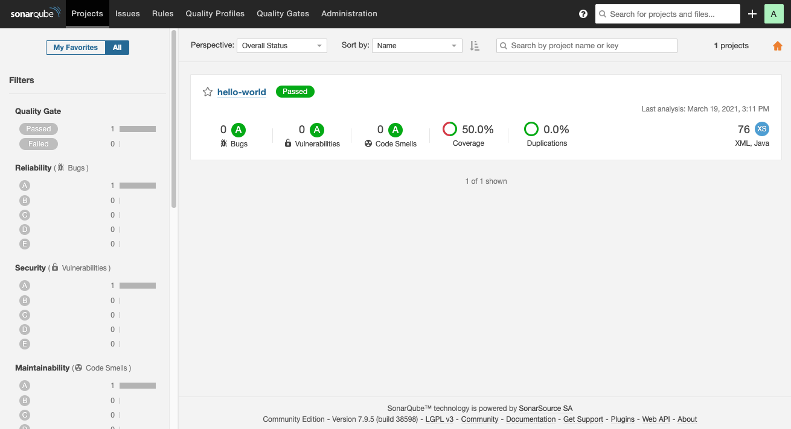
  |-

- 프로젝트 ID를 클릭하면 상세 정보를 확인할 수 있습니다.

  |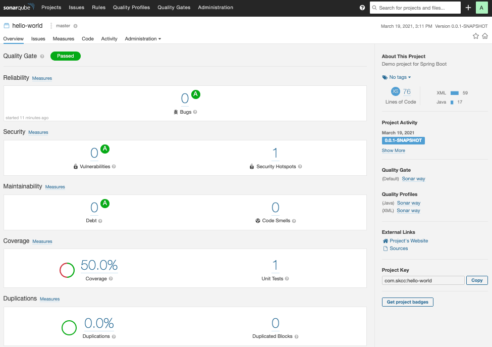
  |-

- **Code** 탭으로 이동하여 정적 분석 결과를 확인합니다.

  |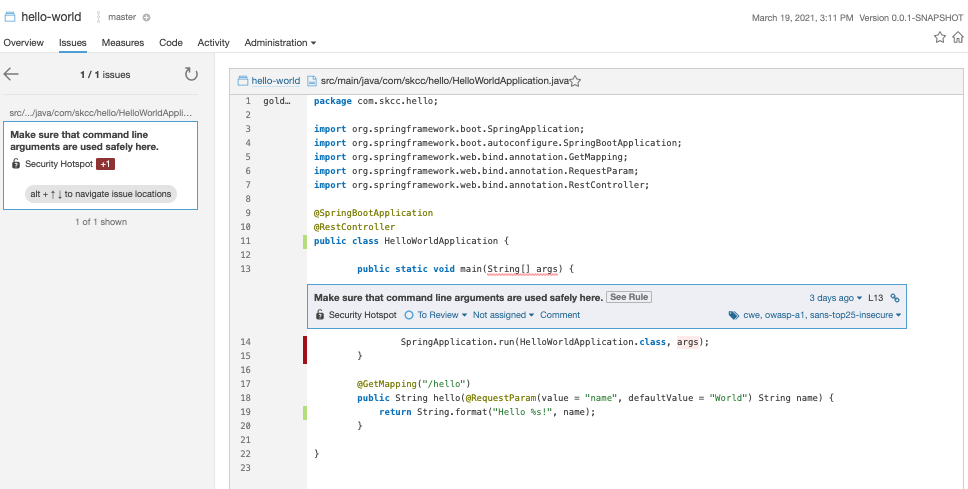
  |-

#
> 참고 사이트

[Using Jenkins - Using credentials](https://www.jenkins.io/doc/book/using/using-credentials/)  
[Build a Java app with Maven](https://www.jenkins.io/doc/tutorials/build-a-java-app-with-maven/)  
[Getting started with Pipeline](https://www.jenkins.io/doc/book/pipeline/getting-started/)  
[Jenkins Pipeline](https://www.jenkins.io/doc/book/pipeline/)  
[Using Docker with Pipeline](https://www.jenkins.io/doc/book/pipeline/docker/)
[JaCoCo Java Code Coverage Library](https://www.eclemma.org/jacoco/)  
[Jenkins Config File Provider plugin](https://plugins.jenkins.io/config-file-provider/)
[코드 분석 도구 적용기 - SonarQube 적용하기](https://velog.io/@lxxjn0/%EC%BD%94%EB%93%9C-%EB%B6%84%EC%84%9D-%EB%8F%84%EA%B5%AC-%EC%A0%81%EC%9A%A9%EA%B8%B0-3%ED%8E%B8-SonarQube-%EC%A0%81%EC%9A%A9%ED%95%98%EA%B8%B0)