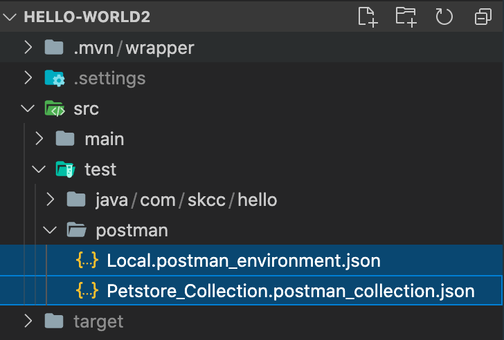
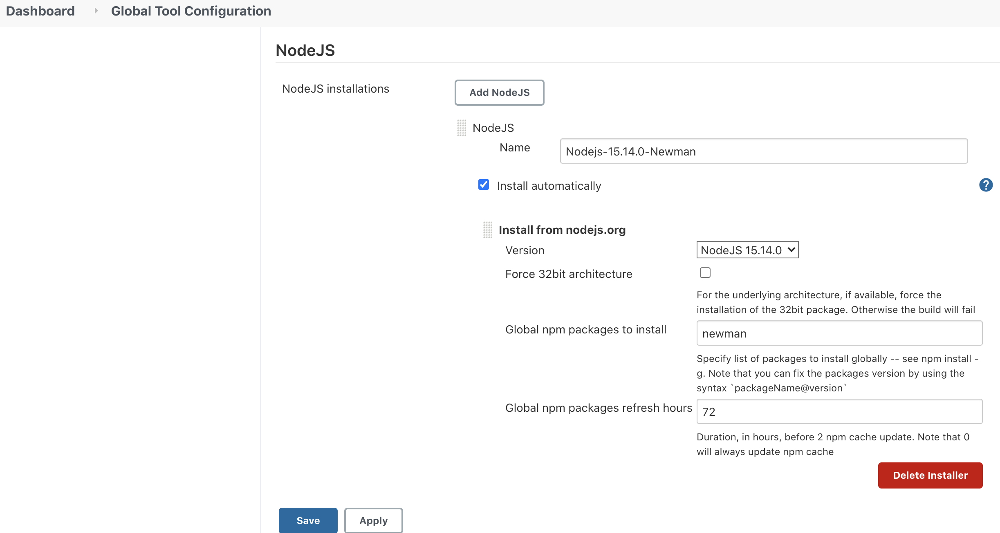
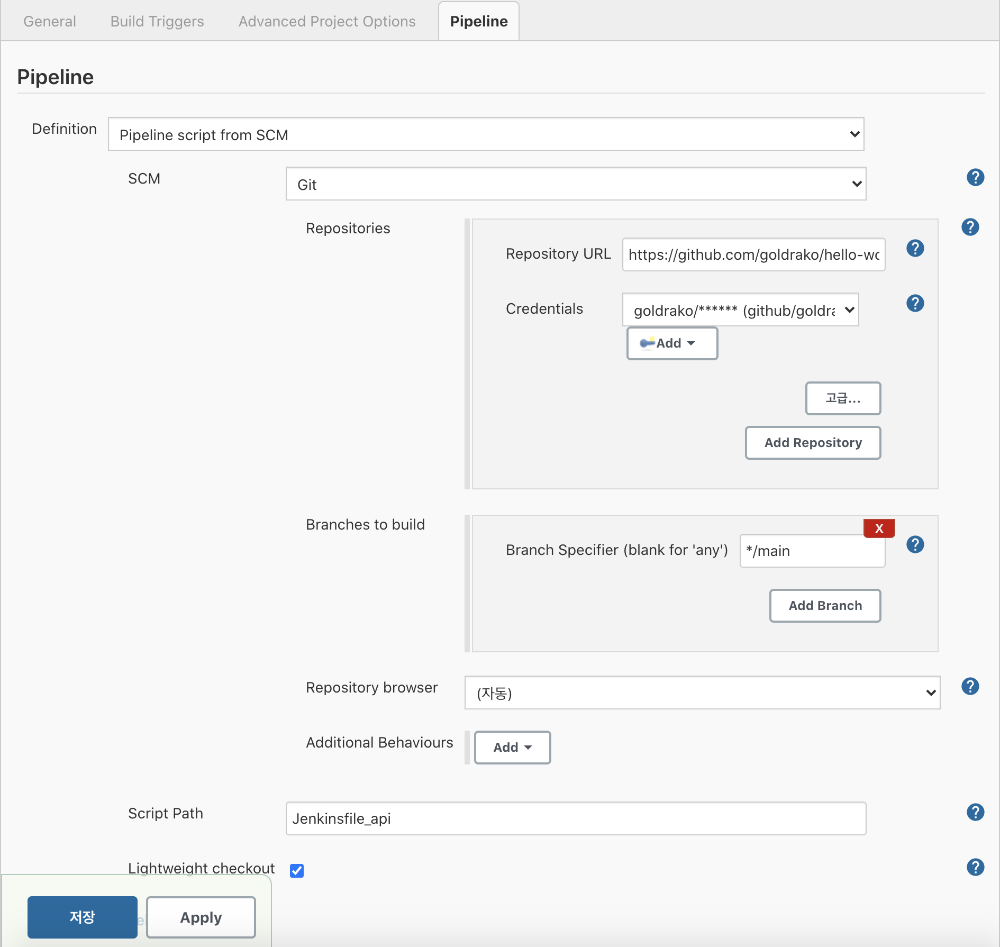
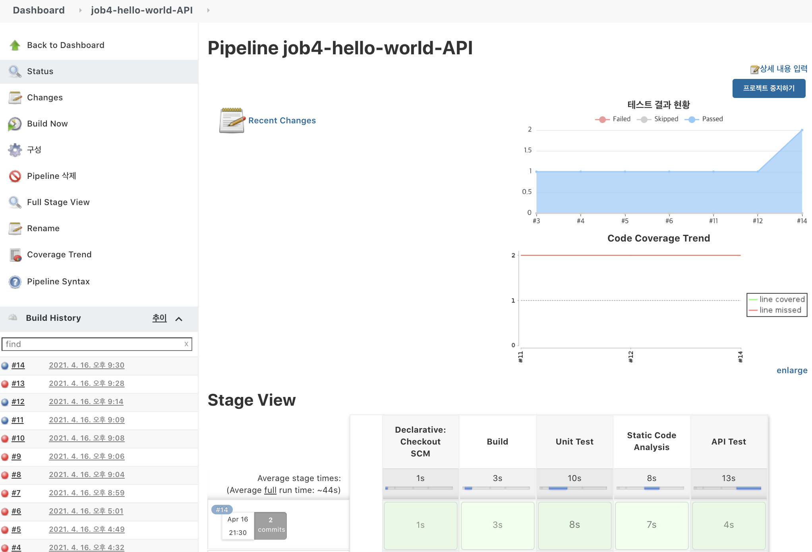

# API Test Pipeline 구축

## POSTMAN-Newman을 위한 Jenkins 환경 설정

### 사전 작업

* [POSTMAN 적용 가이드](POSTMAN_Usage.md) 에서 **사전처리** 항목에서 생성한 JSON 파일
  - export한 2개 json 파일을 아래 디렉토리 위치에 저장 

    
    
    > 접근 가능한 일관된 위치를 만들어 저장함 
    (예: postman 디렉토리를 생성하여 저장)
#
### Jenkins 플러그인 설치

* jenkins > jenkins 관리 > 플러그인 관리 > **`nodejs`** plugin 설치
* Jenkins > jenkins 관리 > 글로벌 도구 구성 관리(Global Tool Configuration) > **`nodejs`** 환경 구성
    - `Name`: `Nodejs-15.14.0-Newman`  ← 단순히 Jenkins Plugin 최상위 버전이름로로 했음
    - `Global npm package to install` : `newman`


|  |
| -------------------------------------------------------------------------- |

#

### Jenkinsfile 에 API Test Stage 추가

```groovy
pipeline { 
    agent any

    stages { 
        stage('Build') {
           steps {
             sh './mvnw clean compile'
           } 
        }
        stage('Unit Test') {
           steps {
             sh './mvnw test'
           }
           post {
             always {
                junit 'target/surefire-reports/*.xml'
                step([ $class: 'JacocoPublisher' ])
            }
          }
        }
        stage('Static Code Analysis') {
            steps {
                configFileProvider([configFile(fileId: 'maven-settings', variable: 'MAVEN_SETTINGS')]) {
                    sh './mvnw sonar:sonar -s $MAVEN_SETTINGS'
                }
            }
        }	
        stage('API Test') {
            steps {
              script {
                try {
                    nodejs('Nodejs-15.14.0-Newman') {
                      sh 'npm install'
                      sh 'newman run src/test/postman/Petstore_Collection.postman_collection.json -e src/test/postman/Local.postman_environment.json \
                          --reporters cli,junit --reporter-junit-export src/test/postman/newman-Report.xml'
                    }
                    sh "echo 'API Test Succeed!'"
                     junit '**/postman/newman-Report.xml'
                } catch (e) {
                    sh "echo 'API Test Failed!'"
                }
              }
            }
        }
    }
}

```

### Pipeline Job 생성

- 사이드 바에서 **새로운 Item (New Item)** 메뉴를 클릭 합니다.
- Job 이름을 입력하고 `Pipeline`를 선택한 다음 **OK** 버튼을 클릭합니다.
- **Pipeline** 탭을 클릭하면 아래로 스크롤 되어 **Pipeline** 섹션으로 이동합니다.
- **Definition** 필드에 `Pipeline script from SCM`을 선택합니다.
- **SCM** 필드에 `Git`을 선택합니다.
- **Repository URL** 필드에 GitHub Repository의 Clone HTTPS URL을 복사하여 붙여 넣습니다.
- **Credentials** 필드에 이전 단계에서 생성한 자격 증명을 선택합니다.
- **Branch Specifier** 필드에 `*/main`으로 수정합니다.
- **Script Path** 필드에 작성한 `Jenkinsfile명`을 기입한 다음 **저장** 버튼을 클릭합니다.

  > 최근 github 대표 브랜치 이름을 **master**에서  **main**으로 바뀌었습니다.

|  |
| -------------------------------------------------------------------------- |

#
### Pipeline Job 실행

- 사이드 바에서 **Build Now**를 클릭하면 Job이 실행됩니다.
- [테스트 결과 현황] 그래프를 확인할 수 있습니다.
   >그래프는 ZCP 환경에서 Jenkins 버전이 plugin 문제로 나타나지 않을 수 있음

|  |
| -------------------------------------------------------------------------- |


- **Build History**에서 **#일련번호**을 선택한 다음, **Console Output**을 선택하면 빌드 로그를 확인할 수 있습니다.

```groovy
...
(생략)
...

+ npm install

up to date, audited 1 package in 243ms

found 0 vulnerabilities
[Pipeline] sh
+ newman run src/test/postman/Petstore_Collection.postman_collection.json -e src/test/postman/Local.postman_environment.json --reporters cli,junit --reporter-junit-export src/test/postman/newman-Report.xml
newman

Petstore_Collection

❏ user
↳ Create user
  POST https://petstore.swagger.io/v2/user [200 OK, 378B, 1805ms]
  ✓  reponse code is 200

↳ Updated user
  PUT https://petstore.swagger.io/v2/user/esse culp [200 OK, 378B, 204ms]

↳ Get user by user name
  GET https://petstore.swagger.io/v2/user/bumseaha [404 Not Found, 385B, 206ms]

┌─────────────────────────┬─────────────────────┬─────────────────────┐
│                         │            executed │              failed │
├─────────────────────────┼─────────────────────┼─────────────────────┤
│              iterations │                   1 │                   0 │
├─────────────────────────┼─────────────────────┼─────────────────────┤
│                requests │                   3 │                   0 │
├─────────────────────────┼─────────────────────┼─────────────────────┤
│            test-scripts │                   1 │                   0 │
├─────────────────────────┼─────────────────────┼─────────────────────┤
│      prerequest-scripts │                   0 │                   0 │
├─────────────────────────┼─────────────────────┼─────────────────────┤
│              assertions │                   1 │                   0 │
├─────────────────────────┴─────────────────────┴─────────────────────┤
│ total run duration: 2.3s                                            │
├─────────────────────────────────────────────────────────────────────┤
│ total data received: 156B (approx)                                  │
├─────────────────────────────────────────────────────────────────────┤
│ average response time: 738ms [min: 204ms, max: 1805ms, s.d.: 754ms] │
└─────────────────────────────────────────────────────────────────────┘
[Pipeline] }
[Pipeline] // nodejs
[Pipeline] sh
+ echo API Test Succeed!
API Test Succeed!
[Pipeline] junit
Recording test results
[Checks API] No suitable checks publisher found.
[Pipeline] }
[Pipeline] // script
[Pipeline] }
[Pipeline] // stage
[Pipeline] }
[Pipeline] // withEnv
[Pipeline] }
[Pipeline] // withEnv
[Pipeline] }
[Pipeline] // node
[Pipeline] End of Pipeline
Finished: SUCCESS
```
> 참고 사이트

[NodeJS | Jenkins plugin](https://plugins.jenkins.io/nodejs/)
