# POSTMAN 적용 가이드

## POSTMAN 설치


## POSTMAN 실습

*  swagger json 파일 import 하기
* 참고 URL : https://petstore.swagger.io/v2/swagger.json

* 메뉴 > 파일 > import

    |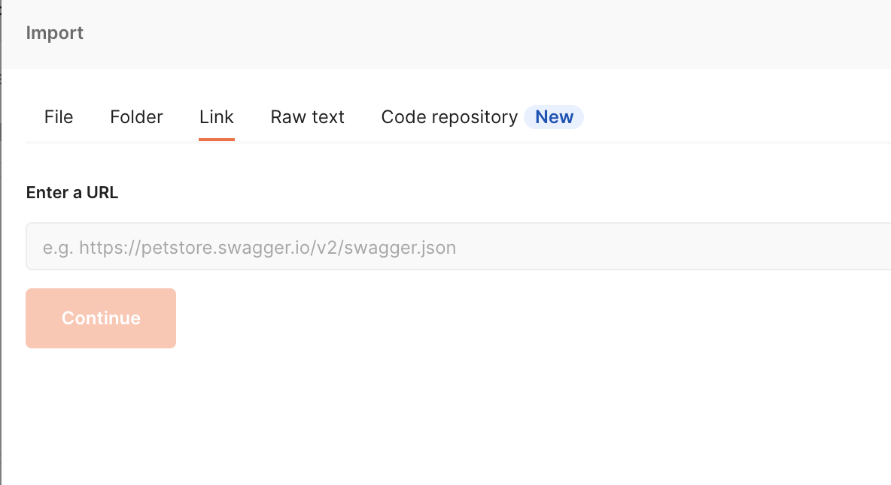
    |-

> import 후 결과 확인

|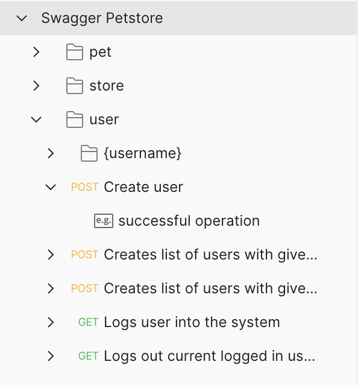
|-

* collection 신규 생성
    - collection 이름 : `Petstore_Collection`
    - 하위폴더 생성 : `user`

### POST 실습

- collection (Swagger Petsotre ) > user > post ( Create user) 복사하여 Petstore_Collection > user 폴더에 붙여넣기

- body에 참고 자료를 이용하여 작성하기

**post body 내용**

```
{
    "id": 5678123490,
    "username": "bumseoha",
    "firstName": "seoha",
    "lastName": "bum",
    "email": "bumseoha@goldrako.kr",
    "password": "andjtdlfRk",
    "phone": "821012345678",
    "userStatus": 0
}
```

|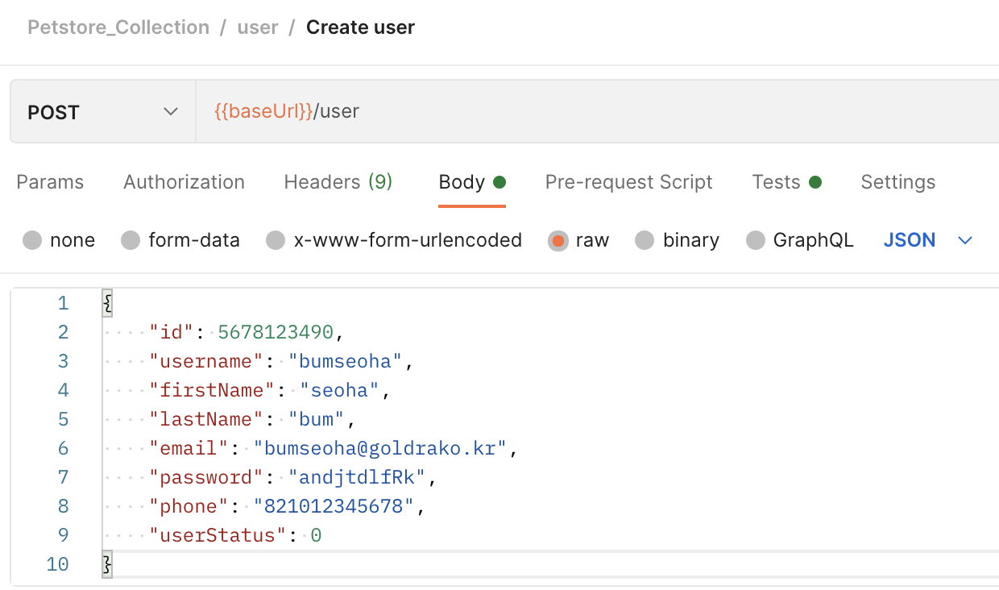
|-


* local 환경 변수에 `{{baseUrl}}` 를 생성

    - valiable : `baseUrl`
    - Initial value / Current value : `https://petstore.swagger.io/v2`

    |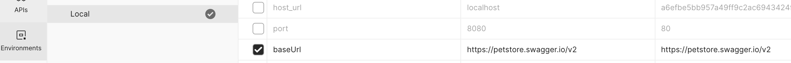
    |-


*  POSTMAN Variable 범위(Scope)
 `Global > Collection > Environment > Local > Data`

- variable 설정
    - 사전 설정 예 
        - Collection Edit > Variable 탭에서 설정
        - Envirionment 영역에서 `key-value` 설정
    - variable 사용 방식
        - 호출 빌더에 사용 : 두개의 중괄호와 변수명으로 사용 `{{variable_name}}`
        - 스크립트에서 사용
            - `:pm.variables.get("variable_key");`  ➞ 자동으로 **Global, Environment**에서 검색하여 적용됨
            - `:pm.environment.set("variable_key", "variable_value");`
            - `:pm.globals.set("variable_key", "variable_value");`

* Tests Script 작성
    - 작성 예 : `tests["reponse code is 200"] = responseCode.code === 200`

    |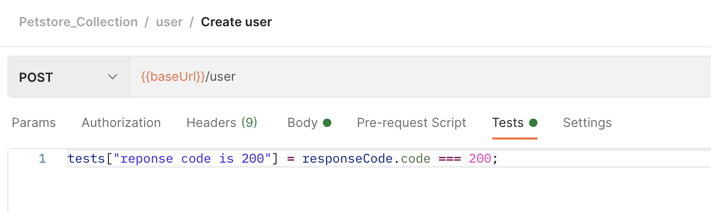
    |-


* Send 실행

    |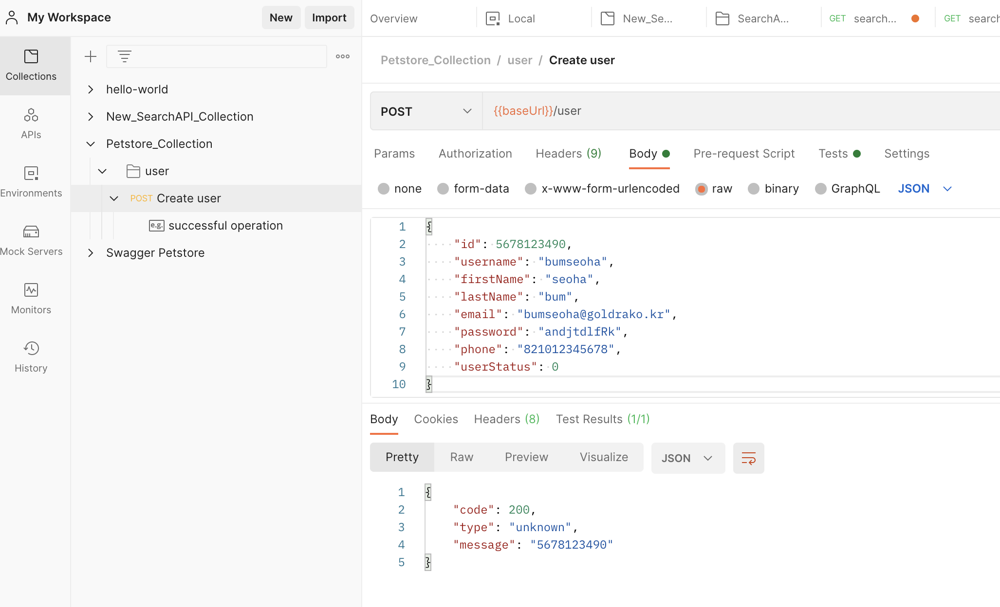
    |-


### PUT 실습

* PUT 방식 호출과 파라메터 처리
    - PUT 메소드은 주로 수정처리에 사용하며 POST 방식과 거의 유사함
    - 차이점은 일반적으로 호출 URL 상에 수정하려는 데이터의 키값이 포함함
    - URL 상에 `:variable_name` 으로 처리

<br>

* PUT Method 생성
    - collection (Swagger Petsotre ) > user > {username} > put ( Update user) 복사하여 Petstore_Collection > user 폴더에 붙여넣기

    |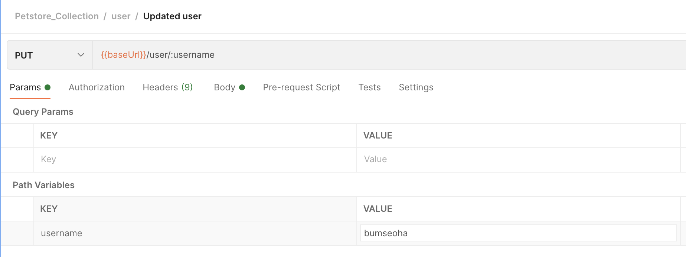
    |-

* body 수정 후 [Send]


    |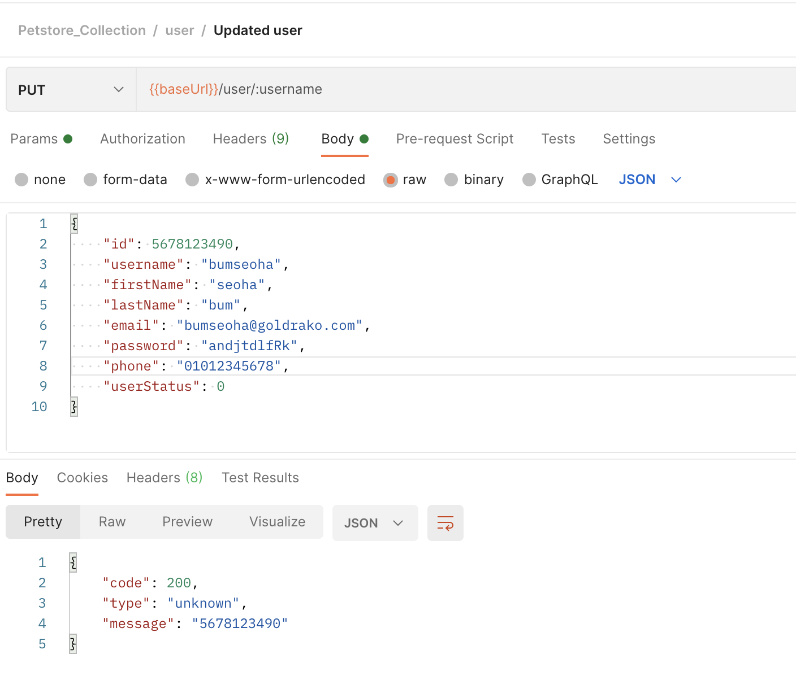
    |-


* PUT 결과 보기 (get Method 호출)

    |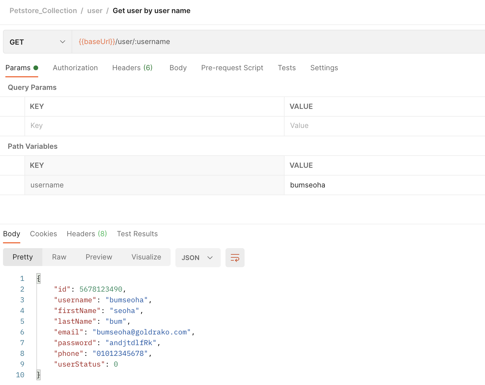
    |-


## Jenkins - POSTMAN - Newman : API 테스트 자동화하기 

*  Newman은 POSTMAN의 Collection을 커맨드라인(CLI)으로 실행하고 리포트를 생성하는 툴이다.

    - 소개 사이트 : 
        - https://www.npmjs.com/package/newman
        - https://github.com/postmanlabs/newman

### ● Newman 설치 (리눅스 환경)

* nodejs 설치
    - 운영체제 별 설치 ( **NodeJS version 4 이상 설치**)
        - https://nodejs.org/en/download/package-manager/
<br>
* npm 명령어 이용하여 Newman 설치

    ```bash
    $ npm install newman --global
    $ npm install newman-reporter-html --global
    ````

    ```bash
    ❯ sudo npm install newman --global
    Password:
    npm WARN deprecated har-validator@5.1.5: this library is no longer supported
    /usr/local/bin/newman -> /usr/local/lib/node_modules/newman/bin/newman.js
    + newman@5.2.2
    added 157 packages from 200 contributors in 7.276s


    ╭────────────────────────────────────────────────────────────────╮
    │                                                                │
    │      New major version of npm available! 6.14.11 → 7.10.0      │
    │   Changelog: https://github.com/npm/cli/releases/tag/v7.10.0   │
    │               Run npm install -g npm to update!                │
    │                                                                │
    ╰────────────────────────────────────────────────────────────────╯

    ❯ newman -v
    5.2.2

    ❯ sudo npm install newman-reporter-html --global
    npm WARN newman-reporter-html@1.0.5 requires a peer of newman@4 but none is installed. You must install peer dependencies yourself.

    + newman-reporter-html@1.0.5
    added 12 packages from 44 contributors in 0.83s
    ```

#### POSTMAN Collection - Newman으로 실행

##### 사전 처리

* POSTMAN `Collection`과 `Environment`을 json파일로 **Export**

   | 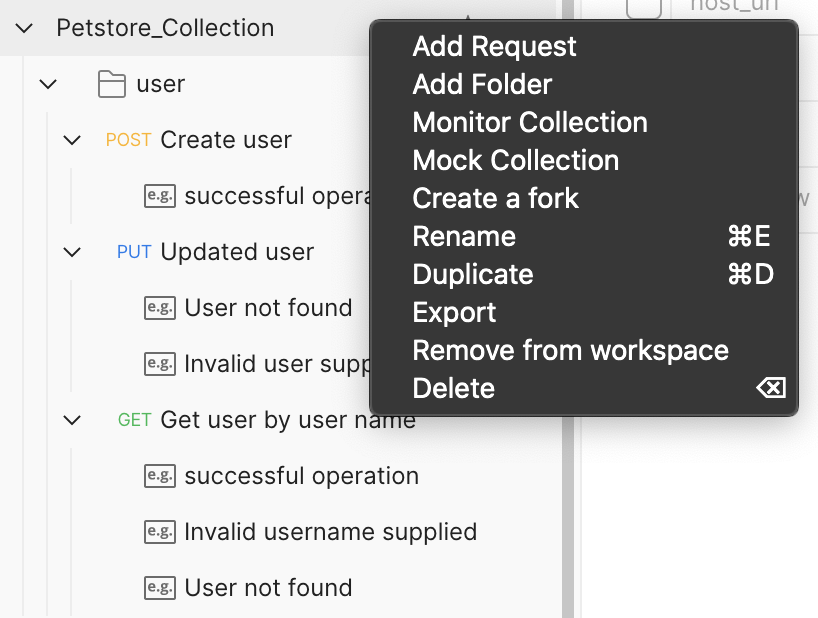 |
   |-
   | 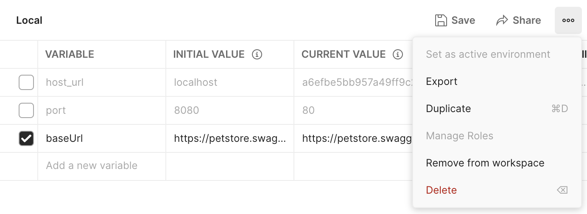 | 
   


#### newman 사용법
참고 사이트 : https://www.npmjs.com/package/newman#usage

- 기본 실행 명령어
    ```
    $ newman run <collection-file-source>
    $ newman run examples/sample-collection.json
    ````
- Collectin 내 특정 디렉토리 하위만 실행 할 때의 옵션
    `--folder <name>`

- 동적으로 Environment 파일을 연결할 때의 옵션
    `--environment <source> 또는 -e <source>`

- 특정 변수를 global 변수로 전달할 때의 옵션
    `--global-var "<global-variable-name>=<global-variable-value>" `

- 테스트 결과 리포트 생성(종류) 옵션
    ```
    --reporters <report-name> 또는 -r <report-name>, 리포트종류는 cli, json, html, junit
    -r html,cli,json,junit
    ※ jenkins 연동을 위해 2가지 이상 형태의 리포트를 생성할 수 있음. 
    ```
    > **주의사항 :** <span style="color:rgb(255, 0, 0)">html,cli 사이에 띄어쓰기하면 안 됨.</span>

#### newman run

```bash
❯ newman run Petstore_Collection.postman_collection.json 
newman

Petstore_Collection

❏ user
↳ Create user
  POST {{baseUrl}}/user [errored]
     getaddrinfo ENOTFOUND {{baseurl}}
  2. reponse code is 200

↳ Updated user
  PUT {{baseUrl}}/user/esse culp [errored]
     getaddrinfo ENOTFO❯ newman run Petstore_Collection.postman_collection.json -e Local.postman_environment.json 
newman

Petstore_Collection

❏ user
↳ Create user
  POST https://petstore.swagger.io/v2/user [200 OK, 378B, 1132ms]
  ✓  reponse code is 200

↳ Updated user
  PUT https://petstore.swagger.io/v2/user/esse culp [200 OK, 378B, 239ms]

↳ Get user by user name
  GET https://petstore.swagger.io/v2/user/bumseaha [404 Not Found, 385B, 220ms]

┌─────────────────────────┬─────────────────────┬─────────────────────┐
│                         │            executed │              failed │
├─────────────────────────┼─────────────────────┼─────────────────────┤
│              iterations │                   1 │                   0 │
├─────────────────────────┼─────────────────────┼─────────────────────┤
│                requests │                   3 │                   0 │
├─────────────────────────┼─────────────────────┼─────────────────────┤
│            test-scripts │                   1 │                   0 │
├─────────────────────────┼─────────────────────┼─────────────────────┤
│      prerequest-scripts │                   0 │                   0 │
├─────────────────────────┼─────────────────────┼─────────────────────┤
│              assertions │                   1 │                   0 │
├─────────────────────────┴─────────────────────┴─────────────────────┤
│ total run duration: 1664ms                                          │
├─────────────────────────────────────────────────────────────────────┤
│ total data received: 156B (approx)                                  │
├─────────────────────────────────────────────────────────────────────┤
│ average response time: 530ms [min: 220ms, max: 1132ms, s.d.: 425ms] │
└─────────────────────────────────────────────────────────────────────┘ 
```


---
> 참고 사이트

[스크립트 기반의 고급기능 1](https://learning.POSTMAN.com/docs/writing-scripts/script-references/POSTMAN-sandbox-api-reference/)
[스크립트 기반의 고급기능 2](https://learning.POSTMAN.com/docs/writing-scripts/script-references/test-examples/)
[Running collections on the command line with Newman](https://learning.postman.com/docs/running-collections/using-newman-cli/command-line-integration-with-newman/)
