# SonarLint 설치 및 구성
---

1. Eclipse Marketplace 에서 sonarlint 검색후 아래와 같이 설치를 진행하시면 됩니다.

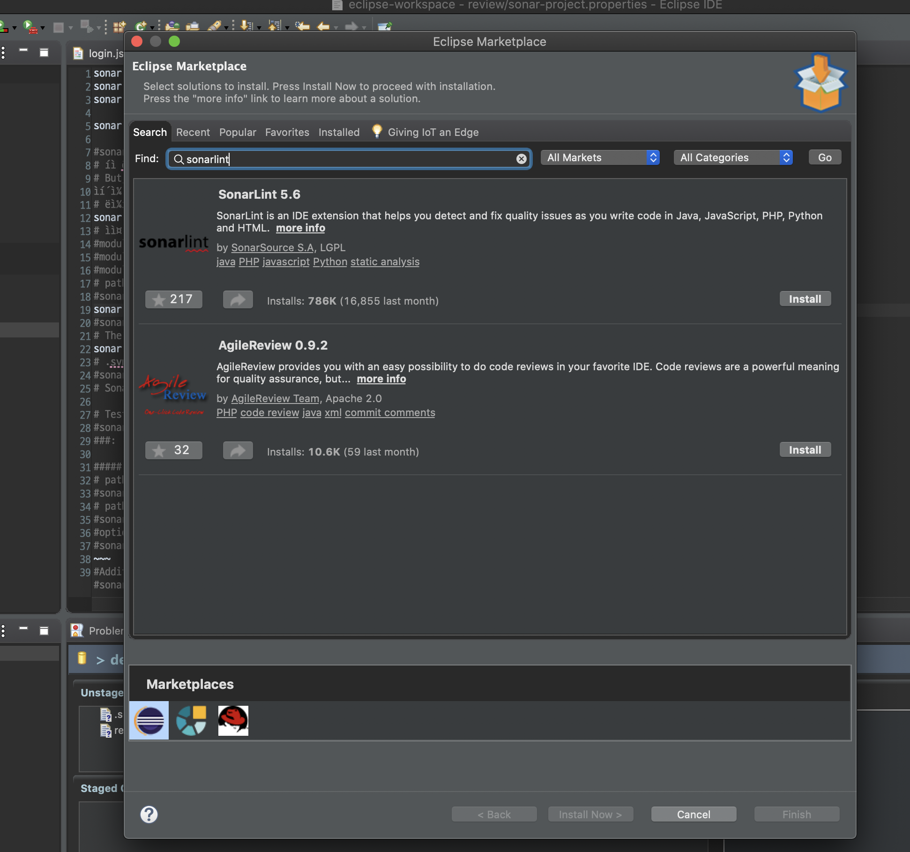

> 사내먕에서 설치가 안 될 때 다운로드 후 압축해제하여 plugins 디렉토리 파일을 sts plugins 디렉토리로 복사하고 sts restart함
  [sonarlint 다운로드](http://binaries.sonarsource.com/SonarLint-for-Eclipse/releases/

#
* 사내망에서 차단되지 않고 정상적인 설치 화면 출력됨.

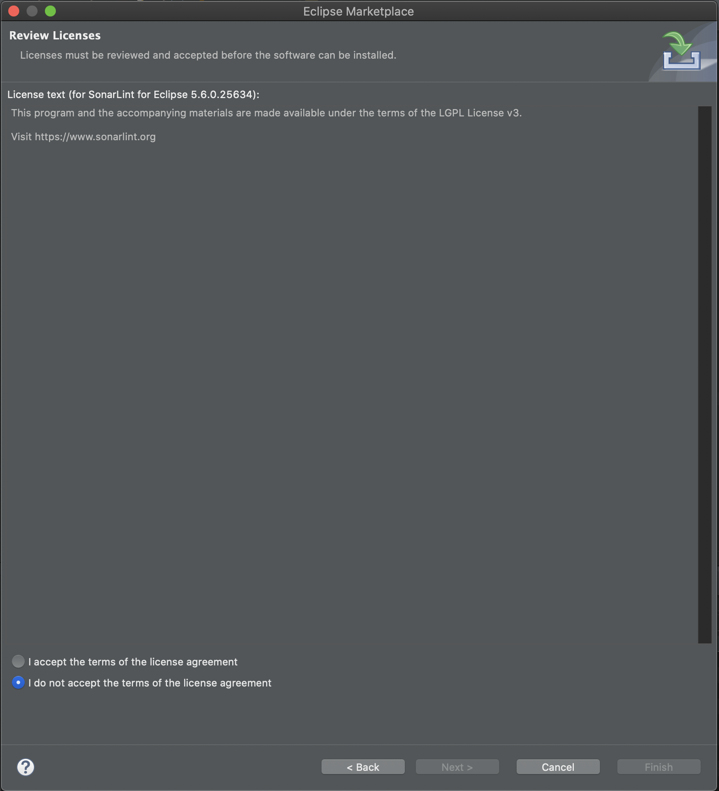

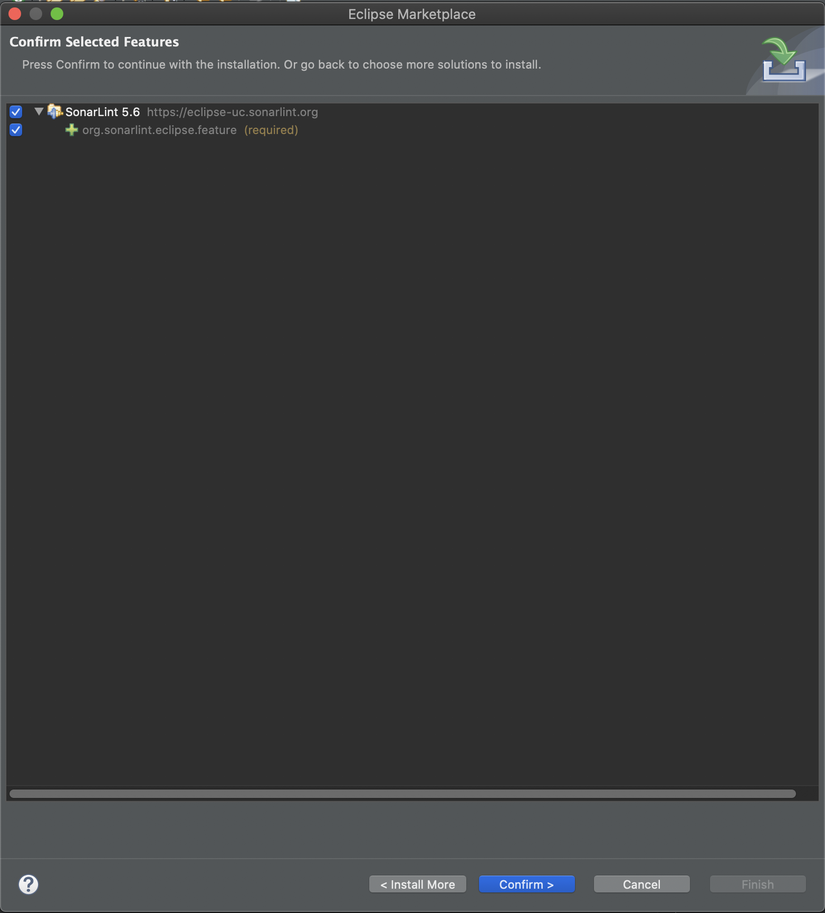

#
* 설치 오류 화면(사내망에서 다운로드가 막힐 때)

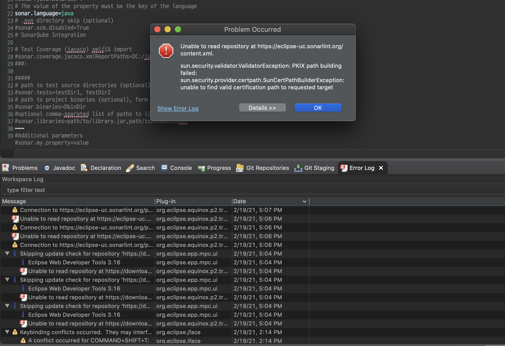

다음과 같이 Window > Show View > Other 에서 보면 SonarLint가 정상적으로 설치된걸 볼 수 있습니다.

#
* on-the-fly 적용

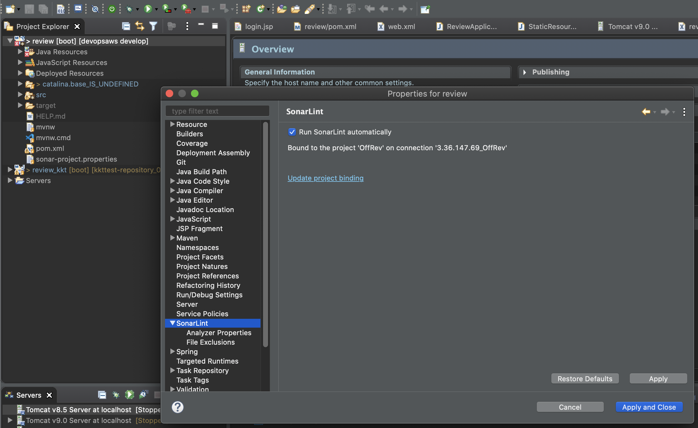

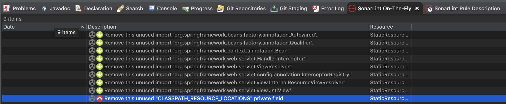

#
* Rule Description

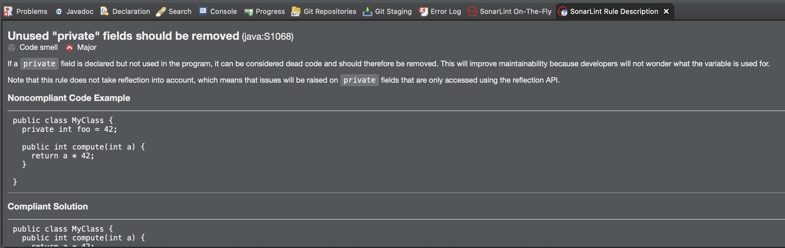

#
* SonarQube서버와 Binding 하기

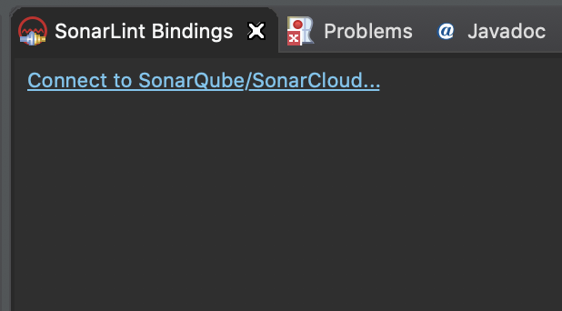
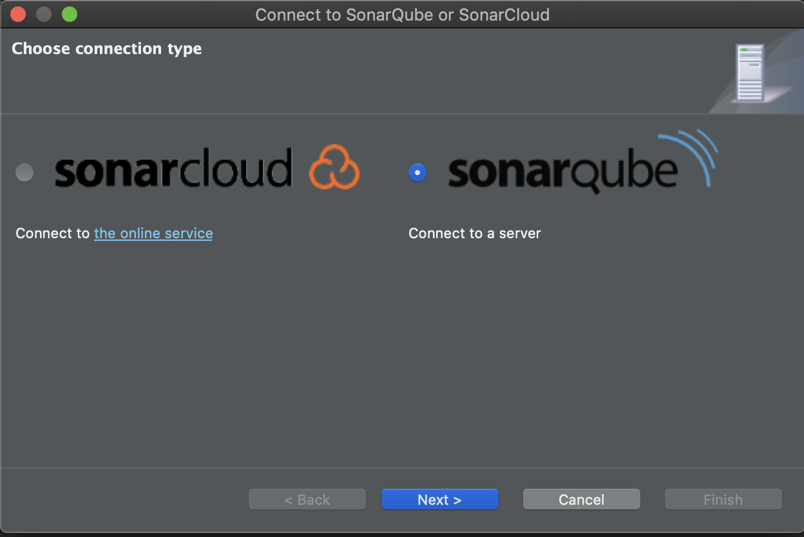

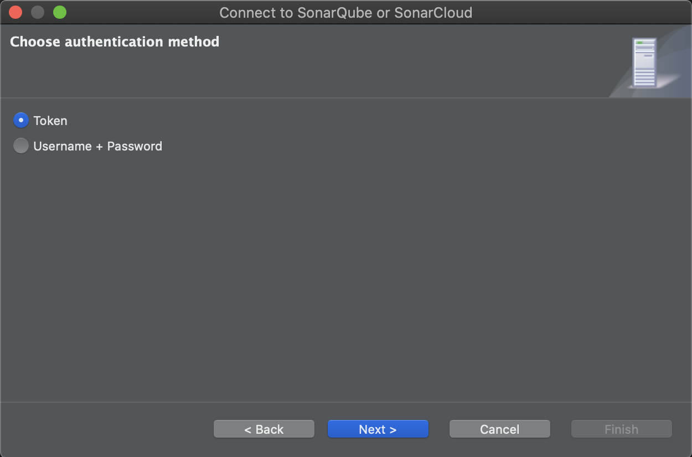
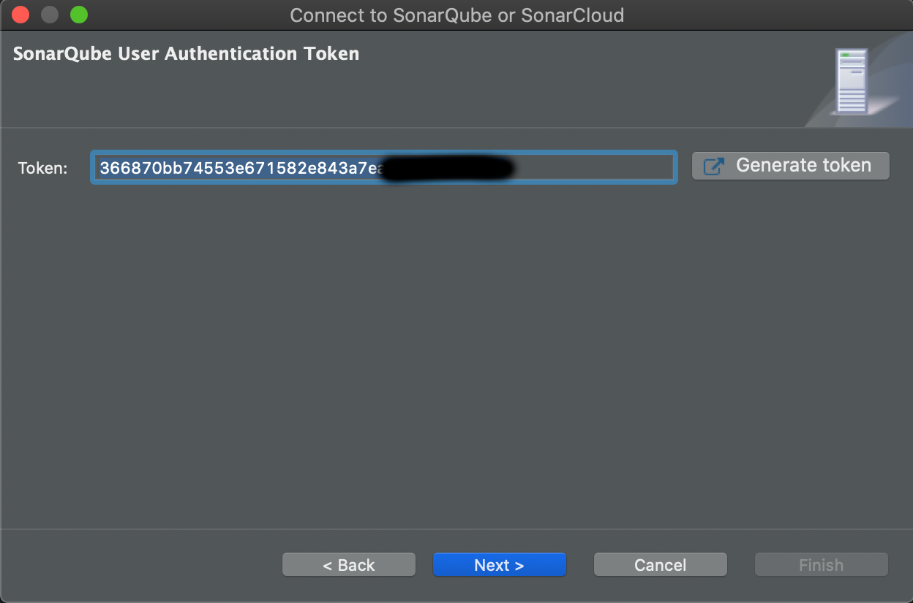
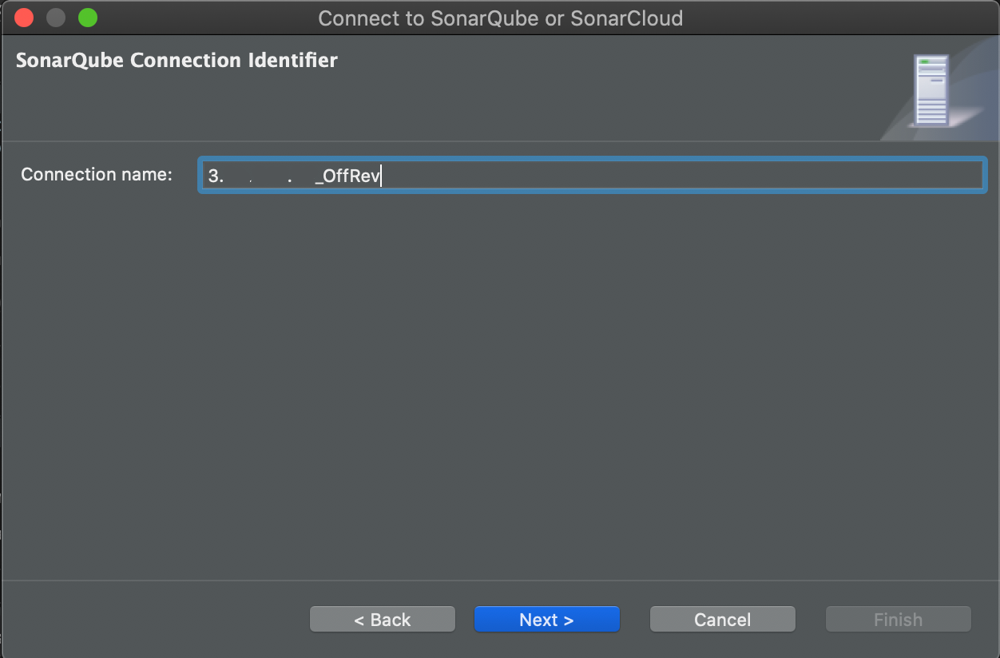
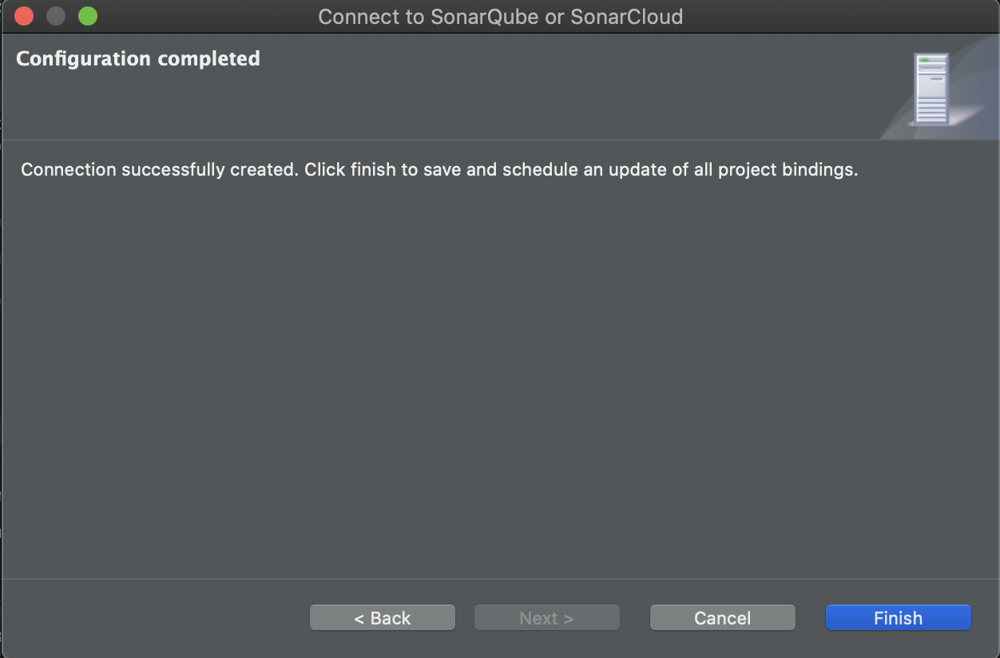

* 프로젝트 바인딩

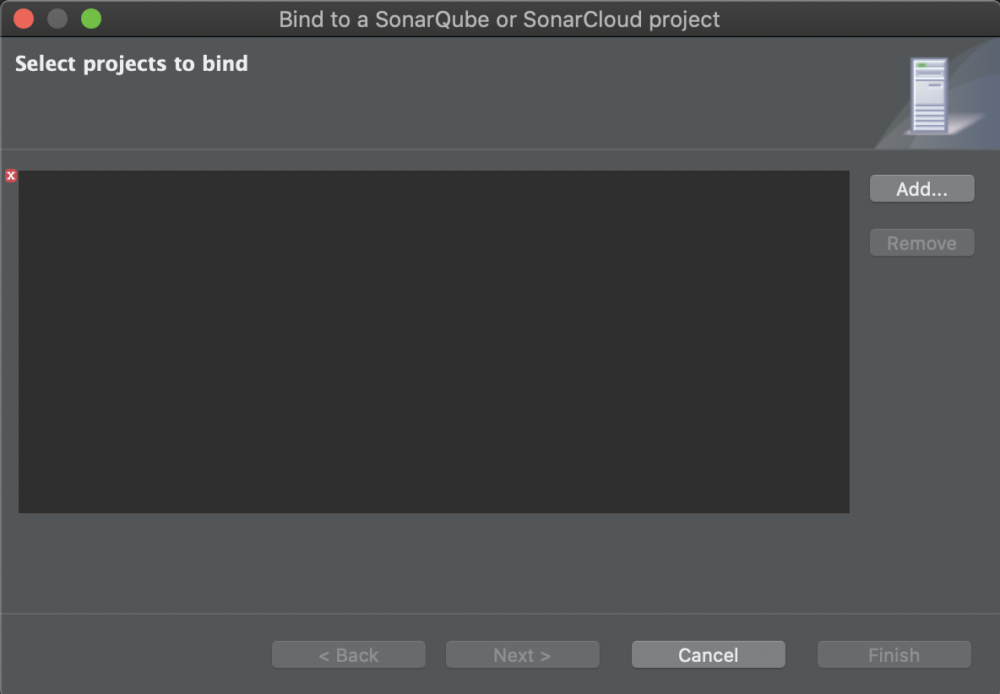
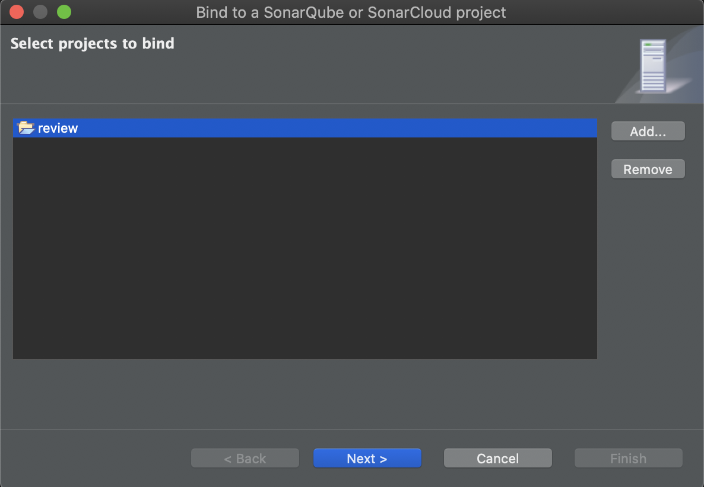
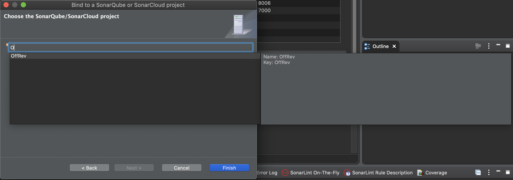
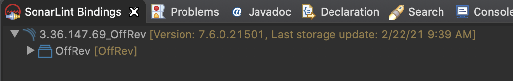

# 
> 참고 사이트

[Eclipse SonarLint 코드 분석 플러그인 사용방법](https://www.mynotes.kr/eclipse-sonarlint-%EC%BD%94%EB%93%9C-%EB%B6%84%EC%84%9D-%ED%94%8C%EB%9F%AC%EA%B7%B8%EC%9D%B8-%EC%82%AC%EC%9A%A9%EB%B0%A9%EB%B2%95/)
[SonarLint(소나린트) 코드 분석 플러그인(코드리뷰)](https://blog.naver.com/zzang9ha/222048392057)
