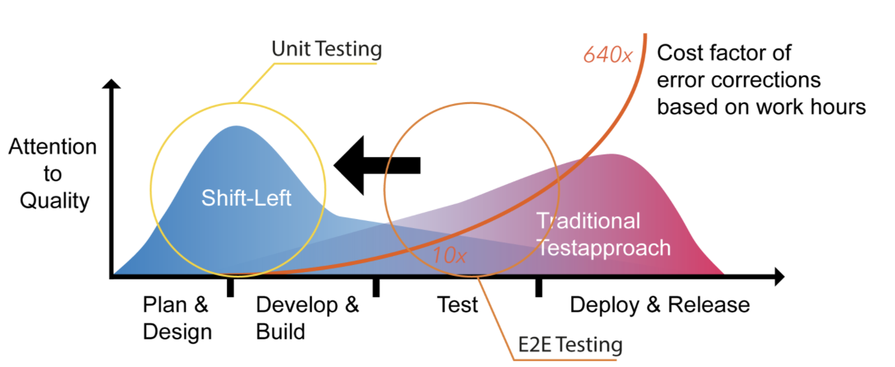
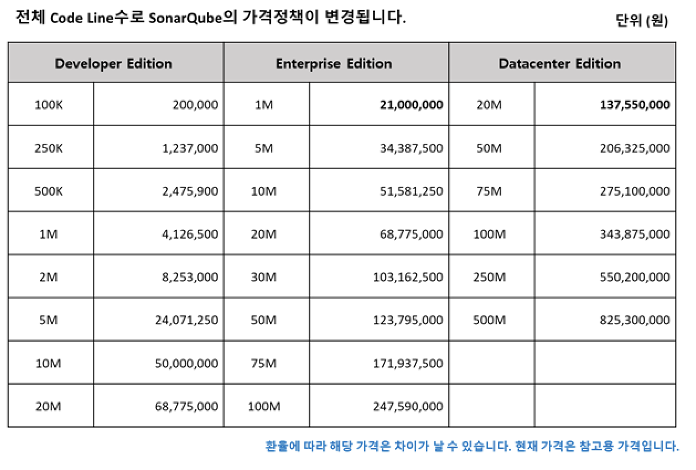

# SonarQube 설치 및 구성
---

## Testing 의미



## 소개

> 홈페이지 : www.sonarqube.org

## Overview


In a typical development process:

1. Developers develop and merge code in an IDE (preferably using [SonarLint](https://www.sonarlint.org/) to receive immediate feedback in the editor) and check-in their code to their ALM.
2. An organization’s continuous integration (CI) tool checks out, builds, and runs unit tests, and an integrated SonarQube scanner analyzes the results.
3. The scanner posts the results to the SonarQube server which provides feedback to developers through the SonarQube interface, email, in-IDE notifications (through SonarLint), and decoration on pull or merge requests (when using [Developer Edition](https://redirect.sonarsource.com/editions/developer.html) and above).


## Prerequisite
> https://docs.sonarqube.org/latest/requirements/requirements/

# Install the Server

## Overview

This section describes a single-node SonarQube instance. For details on clustered setup, see [Install the Server as a Cluster](https://docs.sonarqube.org/latest/setup/install-cluster/).

### Instance components

A SonarQube instance comprises three components:


### Pricing (2020년 기준)


>LOC (Lines of Code)는 어떻게 계산됩니까?
LOC는 분석 된 각 프로젝트의 LOC를 합산하여 계산됩니다. 프로젝트의 LOC 개수는 프로젝트에서 가장 큰 지점의 LOC 개수입니다.

## 설치 과정 (윈도우 환경)

SonarQube Server Download
- https://www.sonarqube.org/downloads/

설치(Unzip)  
- C:\sonarqube

시스템 환경변수 설정
- SONAR_HOME=C:\sonarqube  
- path=%SONAR_HOME%\bin\windows-x86-64;

sonar.properties
- C:\sonarqube\conf\sonar.properties  
- 기본 설정 유지
- sonar.web.host
- sonar.web.context
- sonar.web.port
- sonar.web.javaOpts=-Xmx2048m -Xms1024m -XX:+HeapDumpOnOutOfMemoryError

SonarQube Server 실행, 메뉴 및 기능 확인
- cmd 실행
- startsonar 실행
- "SonarQube is up" 메시지 확인
- http://127.0.0.1:9000/
- 서버 종료 : cmd에서 ‘Ctrl+C’로 Process 종료

 SonarQube Server Update
- admin 계정으로 Login(암호 admin)
- Administration / Marketplace 메뉴
- SonarJava 업데이트 후 Restart ( Off-line Install : https://docs.sonarqube.org/display/PLUG/SonarJava )
- JaCoCo  업데이트 후 Restart  (  Off-line Install : https://docs.sonarqube.org/display/PLUG/JaCoCo+Plugin )


<details markdown="1">
<summary>리눅스 환경에서 설치하기</summary>

<!--summary 아래 빈칸 공백 두고 내용을 적는공간-->

## 설치과정 (리눅스 환경)
Linux Kernel 파라미터 및 ulimit 설정 및 확인

### Linux Kernel 파라미터 및 ulimit 설정 및 확인

#### Linux Kernel 파라미터 및 ulimit 확인

```bash
sysctl vm.max_map_count
sysctl fs.file-max
ulimit -n
ulimit -u
```

#### Linux Kernel 파라미터 및 ulimit 설정

##### 동적 설정

```bash
sudo sysctl -w vm.max_map_count=262144
sudo sysctl -w fs.file-max=65536
ulimit -n 65536
ulimit -u 4096
```

##### 영구적으로 설정

System config 파일을 엽니다.

```bash
sudo vi /etc/sysctl.conf
```

다음 내용을 붙여 넣고 저장합니다.

```bash
vm.max_map_count=262144
fs.file-max=65536
```

`/etc/security/limits.d/99-sonarqube.conf` 파일을 생성한 다음, 아래 내용을 붙여 넣고 저장합니다.

```bash
sudo vi /etc/security/limits.d/99-sonarqube.conf

ubuntu    -    nofile    65536
ubuntu    -    nproc    4096
```
</details>

## Sonar Scanner 설치


### 설치 절차

Sonar-Scanner Download
- https://docs.sonarqube.org/display/SCAN/Analyzing+with+SonarQube+Scanner

설치(Unzip)  
- C:\sonar-scanner

시스템 환경변수 설정
- SONAR_SCANNER_HOME=C:\sonar-scanner  
- path=%SONAR_SCANNER_HOME%\bin;

#### sonar-scanner.properties 수정
- C:\sonar-scanner\conf\sonar-scanner.properties
  (homebrew로 설치 위치 : /usr/local/Cellar/sonar-scanner) 
- 기본 설정 유지
- sonar.host.url
- sonar.sourceEncoding

<details markdown="1">
<summary>sonar-scanner.properties 샘플</summary>

```bash
#Configure here general information about the environment, such as SonarQube server connection details for example
#No information about specific project should appear here

#----- Default SonarQube server
sonar.host.url=http://3.xx.xxx.xxx:9000/

#----- Default source code encoding
sonar.sourceEncoding=UTF-8
```
</details>

#### sonar-project.properties 작성
(pom.xml 파일과 같은 디렉토리에 위치)

<details markdown="1">
<summary>sonar-project.properties 샘플</summary>

```bash
# required metadata
sonar.projectKey=[프로젝트명]
sonar.projectName=[프로젝트명]]
sonar.projectVersion=[Scan History 관리용 버전]
#sonar.projectVersion=20190303

# path to source directories (required)
#sonar.modules=cnaps-core,oms-core,oms-common-shared,oms-criteria,oms-request,oms-servicedesk,oms-sla,oms-trouble
sonar.sources=src
#sonar.sources=.

# path to class directories (optional)
sonar.java.binaries=target
#sonar.java.binaries=.

# The value of the property must be the key of the language 
#sonar.language=java

# .svn directory skip (optional)
#sonar.scm.disabled=True

# SonarQube Integration
#sonar.coverage.jacoco.xmlReportPaths=C:/jacoco/CoverageTestReport.xml

#######################################################################################################################

# path to test source directories (optional)
#sonar.tests=testDir1, testDir2 

# path to project binaries (optional), form example directory of Java
#sonar.binaries=binDir 

#optional comma-sparated list of paths to libraries, only path to ~~~ 
#sonar.libraries=path/to/library.jar,path/to/classes/dir

#Additional parameters 
#sonar.my.property=value
```

</details><br>

#### 실행방법

##### Source Scan 방식 (3가지)
1. 로컬에서 SonarScanner 실행 및 결과 보기 (CLI)

    - cmd 실행
    - cd  C:\pom.xml path\  
    - sonar-scanner
    - SonarQube Home Page에서 결과 확인

2. jenkins - sonarqube scanner - 빌드를 통해
    - https://beomseok95.tistory.com/201
3. jenkins - pipeline
    - https://aws-diary.tistory.com/154?category=835812


# 
> 참고 사이트

[Linux SonarQube 설치](https://confluence.curvc.com/pages/viewpage.action?pageId=6160585)
